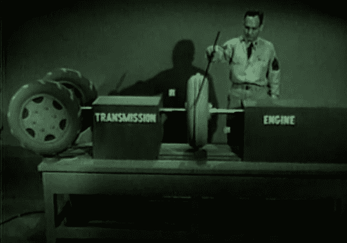

# 逆向工程:流体耦合

> 原文：<https://hackaday.com/2012/12/31/retrotechtacular-fluid-coupling/>

我们知道汽车自动变速器的传动液用于将动力从发动机传递到传动轴。但是看了这段国防部 1954 年的视频后，我们现在对液力耦合器的原理有了全面的理解。和我们一样，你可能已经看过一张变速器的示意图，图中显示了受流动流体影响的扇形叶片。但是，休息后观看 12 分钟的剪辑是值得的，以了解液体是如何移动的，以及为什么这在设计中如此重要。转子的运动，以及外壳的设计，导致流体以连续的螺旋运动——两端相互连接的弹簧形状。这种类型的图示有助于直观理解如何利用液体实现高效的功率传输。

查看 Reddit 帖子中关于这部电影的一些评论。我们同意【Runxctry】；有一些关于演示的格式，使这些信息丰富，引人入胜，几乎上瘾的水平。但也许只是内心深处的工程怪人引起了这些感觉？

[https://www.youtube.com/embed/leCEmJA0WsI?version=3&rel=1&showsearch=0&showinfo=1&iv_load_policy=1&fs=1&hl=en-US&autohide=2&wmode=transparent](https://www.youtube.com/embed/leCEmJA0WsI?version=3&rel=1&showsearch=0&showinfo=1&iv_load_policy=1&fs=1&hl=en-US&autohide=2&wmode=transparent)