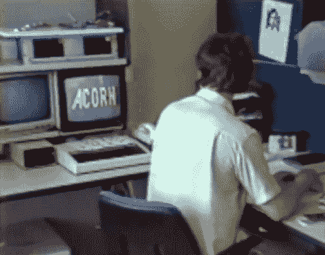

# Retrotechtacular:介绍全新的 Acorn Risc 机器

> 原文：<https://hackaday.com/2012/05/02/retrotechtacular-introducing-the-brand-new-acorn-risc-machine/>

准备好被 1980 年代中期的 Acorn Risc 机器宣传视频弄得神魂颠倒吧。我们肯定大多数人现在已经把它放在一起了，但对于那些较慢的读者来说，这是 ARM 处理器的介绍。

视频什么都有一点。有一个面无表情的叙述，只是在边缘带有一点英国口音。但是在背景中播放的节奏强劲的合成器音轨让它变得更加生动。你会看到许多穿着短袖衬衫的程序员，我们向你挑战，让你数一数出现在镜头前的胡子的数量。但是玩笑归玩笑，想想这种芯片的出现是如何影响世界的是很有趣的。

这篇文章只是我们回顾系列文章的第二部分。我们还没有看到有老电影从读者那里进来。你还在等什么？数字化那个片段，因为[我们想看](http://hackaday.com/contact-hack-a-day/)！当然，这不一定是你自己的电影，所以你遇到的任何涉及几十年前技术的东西都是公平的游戏。

[https://www.youtube.com/embed/hrj-EEnsacQ?version=3&rel=1&showsearch=0&showinfo=1&iv_load_policy=1&fs=1&hl=en-US&autohide=2&wmode=transparent](https://www.youtube.com/embed/hrj-EEnsacQ?version=3&rel=1&showsearch=0&showinfo=1&iv_load_policy=1&fs=1&hl=en-US&autohide=2&wmode=transparent)T2

[途径 [Adafruit](http://www.adafruit.com/blog/2012/04/28/birth-of-the-arm-acorn-archimedes-promo-from-1987/)