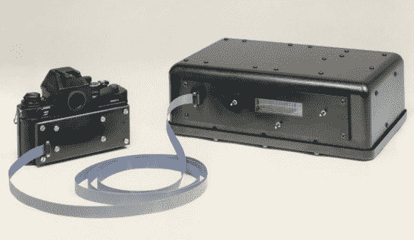

# 回顾:柯达用佳能相机机身制造了世界上第一台 DSLR

> 原文：<https://hackaday.com/2014/06/25/retrotechtacular-kodak-built-worlds-first-dslr-using-a-nikon-camera-body/>

我们已经很久没有看到 Retrotechtacular 了，这是一个很好的开始。从别人口中得知这个故事总是一件乐事。世界上第一台数码单反相机的故事怎么样？[Jame McGarvey]分享了他在 1987 年如何开发该设备的故事。

就是上面显示的。这并不奇怪，相机本身唯一真正的修改是后盖。单反相机和 DSLR 相机之间的区别实际上只是数码相机，这是通过增加一个 CCD 代替胶卷来实现的。

整个故事是一种享受，但有几个我们最喜欢的掘金。这个装置可能的秘密目的很有趣。它是专门设计来作为胶片相机的，这解释了将 CCD 模块连接到控制箱的带状电缆，该控制箱将存储在相机包中。同样令人高兴的是，让伊士曼·柯达开发该系统的客户更喜欢佳能相机机身。所以这台柯达 DSLR 确实使用了佳能 F-1 机身。

一旦你看完这个，你也会喜欢学习 CCD 实际上是如何工作的。

[谢谢本]

Retrotechtacular 是一个每周专栏，以旧时的黑客、技术和媚俗为特色。通过[发送您对未来分期付款的想法](mailto:tips@hackaday.com?Subject=[Retrotechtacular])，帮助保持新鲜感。