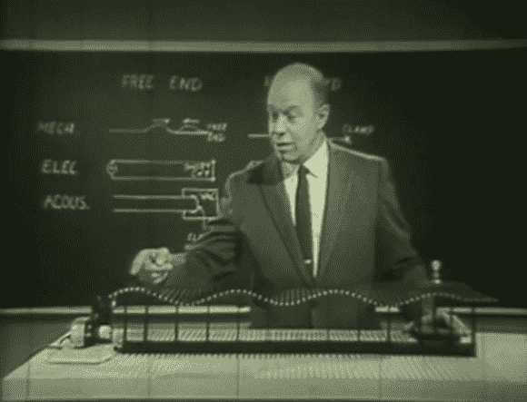

# 逆向技术:波动行为的相似性

> 原文：<https://hackaday.com/2012/12/02/retrotechtacular-similarities-of-wave-behavior/>

本期 Retrotechtacular 关注的是一个视频讲座，它比通常的节目更具实质性。J.N. Shive 博士]是贝尔实验室的一名研究人员，当时几乎每一项技术突破都来自那一群独特的头脑。

这个名为[波浪行为的相似性](http://www.youtube.com/watch?v=DovunOxlY1k)的视频旨在帮助学生快速了解波浪的原理。为了帮助体验，他发明了眼前的装置。它被称为 [Shive 波机](http://en.wikipedia.org/wiki/John_N._Shive#Shive_wave_machine)(在视频的前奏中他们称之为 Shive 波发生器)。由于在大学没有上过任何物理课，我们以前从未见过这种设备。它使用一系列用扭力线互相连接的水平杆。当你打破其中一根棒的平衡时，这根线会把能量以能量波的形式传导给它的邻居。这被证明是波作用的完美表现，不管它是机械的、电的还是声学的。休息后的 28 分钟的视频广泛使用了该设备，并以一种几乎任何人都容易理解的方式解释了概念。

[https://www.youtube.com/embed/DovunOxlY1k?version=3&rel=1&showsearch=0&showinfo=1&iv_load_policy=1&fs=1&hl=en-US&autohide=2&wmode=transparent](https://www.youtube.com/embed/DovunOxlY1k?version=3&rel=1&showsearch=0&showinfo=1&iv_load_policy=1&fs=1&hl=en-US&autohide=2&wmode=transparent)

[via [Reddit](http://www.reddit.com/r/ECE/comments/13zwjd/a_video_worth_watching_bell_labs_similarities_of/)