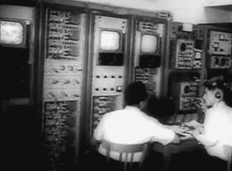

# 回溯技术:卫星通信的诞生

> 原文：<https://hackaday.com/2012/07/17/retrotechtacular-the-birth-of-satellite-communications/>

上周是第一颗通信卫星 Telstar 1 发射五十周年纪念日。回顾一下早期技术的奇迹，如[中所示，这是关于第一次广播的新闻短片](http://www.youtube.com/watch?v=-j_xoETaiww)。第一次正式使用是肯尼迪总统的一次演讲，允许大部分欧洲国家“见证民主的运作”。你一定会喜欢冷战时期的宣传。

除了这个充满电子设备的奇迹，当时还有其他使用无源设备作为卫星的实验在进行。回声项目试图将反射气球放置在一个高度，这样它们可以用来在地球的曲率周围反射信号。这几乎正好发生在 Telstar 1 问世的两年前。

有很多媒体报道了这个周年纪念日，但对我们来说最有趣的是 NPR 对帮助建造这个设备的工程师之一[沃尔特·布朗]的采访。显然，发射前一天在太空进行的核武器试验导致了最初的试验失败。

[https://www.youtube.com/embed/-j_xoETaiww?version=3&rel=1&showsearch=0&showinfo=1&iv_load_policy=1&fs=1&hl=en-US&autohide=2&wmode=transparent](https://www.youtube.com/embed/-j_xoETaiww?version=3&rel=1&showsearch=0&showinfo=1&iv_load_policy=1&fs=1&hl=en-US&autohide=2&wmode=transparent)