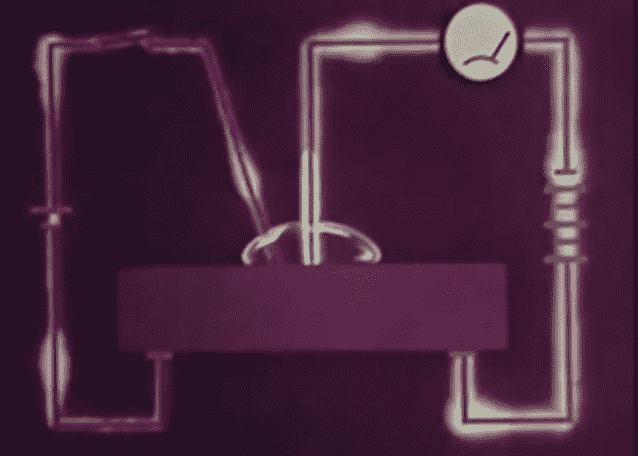

# 晶体管的起源

> 原文：<https://hackaday.com/2014/01/14/retrotechtacular-the-genesis-of-the-transistor/>

很少有分娩是容易的。获得诺贝尔奖的人就更少了，而且几乎没有一个是三个人的作品。这部来自 AT & T 档案馆的 [1965 年的电影回顾了晶体管诞生的九年后，晶体管的创造者【沃尔特·布拉顿】、【约翰·巴丁】和【威廉姆·肖克利】因发现并实现了晶体管效应而获得了诺贝尔物理学奖。](http://www.youtube.com/watch?v=WiQvGRjrLnU)

晶体管是对锗等半导体研究的结果。在直接导致晶体管的研究之前，人们知道半导体的电导率随着温度的升高而增加。钨等金属的情况正好相反。当暴露在光线下时，半导体的导电性也会增加。他们发现的另一个关键是，当铜等金属与半导体接触时，一个方向的电导率比另一个方向的电导率低。这种特殊的性质在早期的无线电技术中得到了利用，如[晶体无线电](http://en.wikipedia.org/wiki/Cat's-whisker_detector)，用于电话中的氧化铜整流器，以及二战中的微波雷达。

第二次世界大战后，美国电话电报公司的贝尔实验室投入了大量的时间和研究来研究半导体，因为他们的属性还没有完全了解。研究人员专注于最简单的半导体，硅和锗，并在两个领域这样做:体属性和表面属性。在此期间，【肖克利】提出[场效应](http://en.wikipedia.org/wiki/Field_effect_(semiconductor))，假设半导体表面附近的电子可以在外电场的影响下被控制。

这一效应将在扩增领域取得巨大进展。[Bardeen，Brattain 和 Shockley]测试了金属相对于锗板表面的接触电势。[Brattain]提出，移动金属导体穿过锗会在连接两者的导线中产生电流，添加电解质会导致放大。为了进行实验，[巴丁]提出了下面的模型:一片锗，一滴水作为电解质，一根蜡线穿过水与锗接触。第二根导线与水接触，两个电路都有电位。

果然，左边的电流影响了通过蜡点的电势，他们自己有了一个工作的半导体放大器。这个实验对晶体管的发展至关重要。

然而，这个实验并不是没有问题。水电解质蒸发太快，所以他们尝试乙二醇硼酸盐。这样效果更好，但电路不会放大到 8Hz 以上。他们用一片薄薄的金箔代替电解质，并在金箔边缘附近使用触点，而不是蜡点。【巴丁、布拉顿和肖克利】将由此产生的现象称为“晶体管效应”。1947 年圣诞节前两天，他们在电路上讲话，听到了明显的增益。这种安排将成为第一个生产线模型，被称为[点接触晶体管](http://en.wikipedia.org/wiki/Point-contact_transistor)。

进一步的研究导致了锗单晶的生长，这使得[结晶体管](http://en.wikipedia.org/wiki/Grown-junction_transistor)成为可能。几年后，在 1951 年，T2 合金晶体管 T3 被开发出来。这些频率有限，一次只能生产一个。1954 年，一种高频、高速器件——扩散基极晶体管被开发出来。

这就是我们一直想要的:一个极其可靠的设备，能够以非常高的速度和非常低的功率水平传输和放大高频信号。难怪他们获得了诺贝尔奖。

[https://www.youtube.com/embed/WiQvGRjrLnU?version=3&rel=1&showsearch=0&showinfo=1&iv_load_policy=1&fs=1&hl=en-US&autohide=2&wmode=transparent](https://www.youtube.com/embed/WiQvGRjrLnU?version=3&rel=1&showsearch=0&showinfo=1&iv_load_policy=1&fs=1&hl=en-US&autohide=2&wmode=transparent)

[谢谢赫南迪]

Retrotechtacular 是一个每周专栏，以旧时的黑客、技术和媚俗为特色。通过[发送您对未来分期付款的想法](mailto:tips@hackaday.com?Subject=[Retrotechtacular])，帮助保持新鲜感。