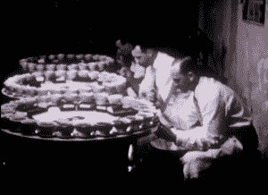

# 咖啡时间到了

> 原文：<https://hackaday.com/2014/09/03/retrotechtacular-time-for-coffee/>

如果你问我们，它几乎总是一个喝咖啡的好时间。本周的焦点是一部由 A & P 制作的教育/宣传片，他在 19 世纪以提供咖啡和茶的连锁商店起家。到 20 世纪 50 年代，他们开始经营完全自助的杂货店，随之而来的是一系列关闭的夫妻店。

这是一个关于咖啡从苗圃到田地，再到你当地 A&P 的货架的故事。它涵盖了来自南美作物的咖啡的种植、栽培和分销，当时仅在巴西就覆盖了 100 多万平方英里。

咖啡树在两岁时离开苗圃，被种植在营养丰富的红土中。两到三年后，它们结出了第一批果实。咖啡首先开花，果实在接下来的 8-9 个月成熟。熟练的工人手工采摘浆果。我们被告知平均每棵树每年生产一磅烘焙咖啡。

当天的收获被收集、称重并装袋，以便进一步生产。水果被压碎以去除红色外皮中的每一粒豆子。然后，将豆子洗净，摊开在阳光下晒 8-10 天。它们经常旋转，所以干燥均匀。干咖啡装在袋子里，送到城市里。

在仓库里，咖啡被检查、分类和分级。在运往海港之前，袋子上都印有咖啡的原产国和预定目的地。这里发生了非常重要的一步。当每个袋子扛在一名工人的肩上走过时，另一名工人会刺穿袋子以获取咖啡豆的样本。现场的 T2 官员在这一点上接管并做他们自己的检查，把样品送到美国。在这里，咖啡被烘焙，并从一个装满瓷杯的大转盘上品尝味道和强度。

这部电影简短地告诉我们，拉丁美洲的大城市是建立在咖啡出口的劳动之上的。我们看到了远景、天际线和海岸线的组合，这又把我们带回了将咖啡运往各个停靠港的主题。在码头，袋子被滚落到大网上，然后装上船。由于咖啡易受潮，所以要特别注意避免离开热带地区带来的不良影响。

[https://www.youtube.com/embed/e8rE9TuytFM?version=3&rel=1&showsearch=0&showinfo=1&iv_load_policy=1&fs=1&hl=en-US&autohide=2&wmode=transparent](https://www.youtube.com/embed/e8rE9TuytFM?version=3&rel=1&showsearch=0&showinfo=1&iv_load_policy=1&fs=1&hl=en-US&autohide=2&wmode=transparent)

Retrotechtacular 是一个每周专栏，以旧时的黑客、技术和媚俗为特色。通过[发送您对未来分期付款的想法](mailto:tips@hackaday.com?Subject=[Retrotechtacular])，帮助保持新鲜感。