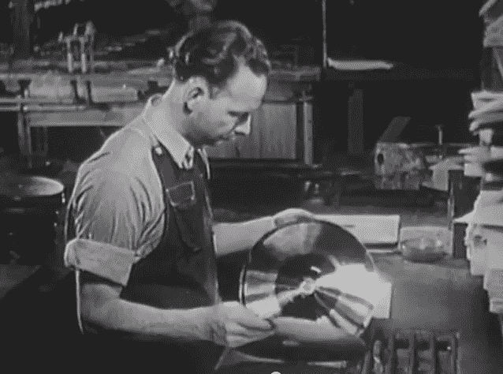

# 蜡上、蜡下:记录是如何产生的

> 原文：<https://hackaday.com/2013/12/31/retrotechtacular-wax-on-wax-off-how-records-are-made/>

在新泽西州卡姆登 [RCA Victor 工厂](http://en.wikipedia.org/wiki/Nipper_Building)的【1942 年之旅中，我们看到了从主切割生产到多重 78RPM 虫胶压制的运输的完整记录制作过程。这部电影围绕着由 20 世纪 40 年代相当于录音室音乐家的维克多沙龙管弦乐团演奏的[施特劳斯的《蓝色多瑙河](http://en.wikipedia.org/wiki/The_Blue_Danube)华尔兹的录音展开。

在无尘室里，主唱片开始时是一层薄薄的熔化的蜡倒在一个热的圆形盘子上。气泡和杂质被吹走，蜡在一个钢圆顶下冷却。这张完美的唱片通过一个特殊的槽被小心翼翼地送到录音棚，在那里它被小心翼翼地放在切割唱针的下面。

与今天的多音轨录音会议不同，大师从整个乐队或管弦乐队的演奏中分离出来，就像他们在音乐会上一样。录音师负责在飞行中进行快速更改，以确保音波 和凹槽宽度 的一致性。

切割后，精致的蜡经历了几个阶段的[电解](http://en.wikipedia.org/wiki/Electrolysis)形成金属母模。首先用纯金轰击它，然后用硫酸铜轰击两次，以构建一个坚固的圆盘。铜电离过程也确保了最终产品的高保真度。

虽然强大，但这位大师无法持续足够长的时间来完成所有必要的压制，因此母矩阵被制造出来。这是大师的负面形象。母模是通过将母模电解浸在镍中，然后添加某种不确定物质的薄膜而形成的。又一次铜浴，母亲出现了。主人会尽快被分离出来，并被带到储藏室。

由于压制需要阳图，所以制作了冲压模具。母亲得到一个镍浴的耐用性，然后铜浴形成冲压矩阵。制造了许多压模，以便一次可以压制几个记录。这些图像镀了一层铬，以帮助它们在多次压制后仍能保存。

在钻取精确定位的主轴孔之前，压模被焊接到一个坚硬的衬垫上。该孔由机器居中，并在光盘旋转时通过放大凹槽进行检查。最后一次清洗压模以去除灰尘，最后一次刷掉并抛光。

这些每分钟 78 转的唱片是由来自印度的最好的虫胶、来自东印度群岛的树脂和 18 种其他秘密药草和香料制成的，它们都在一个三层的[班伯里密炼机中加热混合。得到的面团被擀成薄片，切成饼干，饼干是比最终记录略大的方形块。](http://en.wikipedia.org/wiki/Industrial_mixer)

饼干在被压制前会在蒸汽桌上重新加热。标签应用是压制过程的一部分，两面同时压制。在这之后，粗糙的边缘被平滑，并且每个记录被人耳测试。最后，它被抛光，装套，计数，装箱，准备运往伍尔沃斯，沃纳梅克，或任何地方。

这部电影制作几年后，开始转向 33RPM 黑胶唱片。这些年来，这个过程真的没有什么变化。母版、母模板和冲压模板现在浸泡在不同的化学物质中，最终结果是被压制成乙烯基饼干而不是虫胶。

[https://www.youtube.com/embed/qdhNNaQhgv8?version=3&rel=1&showsearch=0&showinfo=1&iv_load_policy=1&fs=1&hl=en-US&autohide=2&wmode=transparent](https://www.youtube.com/embed/qdhNNaQhgv8?version=3&rel=1&showsearch=0&showinfo=1&iv_load_policy=1&fs=1&hl=en-US&autohide=2&wmode=transparent)

[感谢姆西姆]

Retrotechtacular 是一个每周专栏，以旧时的黑客、技术和媚俗为特色。通过[发送您对未来分期付款的想法](mailto:tips@hackaday.com?Subject=[Retrotechtacular])，帮助保持新鲜感。