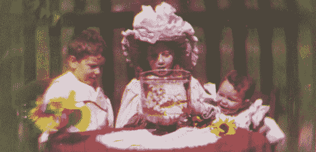

# 世界上第一部彩色电影

> 原文：<https://hackaday.com/2013/11/05/retrotechtacular-worlds-first-color-movie/>

令人惊讶的是，一个绝妙的想法往往在多年后才被人发现。在这种情况下，这个概念在十年内被公开，但发明者的才华在 110 年后再次受到赞赏。这是一部大约在 1901 年或 1902 年拍摄的彩色电影，但听起来好像直到 2012 年英国国家媒体博物馆开始调查一部特定电影的历史时，这部电影才以其完整的色彩展示出来。

策展人在这个视频中很好地讲述了这个故事，这个视频也在休息后嵌入。这个卷轴已经被他们收藏多年了。被贴上彩色标签的是黑白胶片。它只需要一个聪明而好奇的团队在滤色器的帮助下将三个画面放在一起。似乎[爱德华·特纳]在 1899 年申请了一项专利，该专利使用红色、绿色和蓝色滤镜来捕捉连续的胶片帧。专利描述帮助研究人员将这些帧图像-也使用过滤器-产生像上面看到的全色图像。

关于这个项目的新闻稿分享了更多的信息，比如他们如何通过系谱研究确定这部电影的年代，以及特纳本人死于 1904 年的事实。这一过程并没有随着他的去世而消亡，而是在 1909 年公开展示。然而，这是迄今为止发现的最古老的彩色电影。

[https://www.youtube.com/embed/XekGVQM33ao?version=3&rel=1&showsearch=0&showinfo=1&iv_load_policy=1&fs=1&hl=en-US&autohide=2&wmode=transparent](https://www.youtube.com/embed/XekGVQM33ao?version=3&rel=1&showsearch=0&showinfo=1&iv_load_policy=1&fs=1&hl=en-US&autohide=2&wmode=transparent)

[https://www.youtube.com/embed/1V0Vc5iRoLY?version=3&rel=1&showsearch=0&showinfo=1&iv_load_policy=1&fs=1&hl=en-US&autohide=2&wmode=transparent](https://www.youtube.com/embed/1V0Vc5iRoLY?version=3&rel=1&showsearch=0&showinfo=1&iv_load_policy=1&fs=1&hl=en-US&autohide=2&wmode=transparent)

[感谢托尼通过[纽约每日新闻](http://www.nydailynews.com/entertainment/tv-movies/first-ever-color-movie-found-britain-national-media-museum-bradford-article-1.1158971)