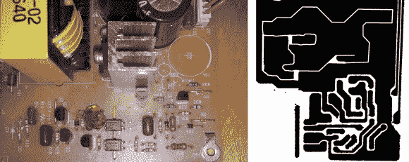

# 对 PSU 进行逆向工程以改变其输出电压

> 原文：<https://hackaday.com/2013/07/20/reverse-engineer-a-psu-to-change-its-output-voltage/>

[Semicolo]手头有一堆旧 PSU，是他从一些 Lexmark 点阵打印机中取出来的。在他们的库存形式中，他们生产 40V，这接近于他需要运行他一直在建造的 3D 打印机上的步进电机的最大 35V。所以他对 PSU 进行了逆向工程，以改变它的输出。

在左边你可以看到印刷电路板的顶部。[Semicolo]把它翻过来，拍了一张板子底部痕迹的照片。通过在 Gimp (FOSS 图像编辑软件)中做一些工作，他能够将痕迹转换成黑白的。用 50%透明度的走线覆盖顶部的图片，可以很容易地看到连接并生成硬件原理图。这真是一个很酷的把戏！

弄清楚它应该如何工作是实现他的目标的一大步。下一步是看他是否能随心所欲地改变电路。他之前遇到过 ATX·PSU 黑客，他们通过改变参考电压来改变输出。他拿到了 HA17431 可变分流调节器的数据手册。它展示了如何根据一些外部元件的值来调整输出。他放入一个电阻，测得输出为 31V，正好在他的目标范围内。