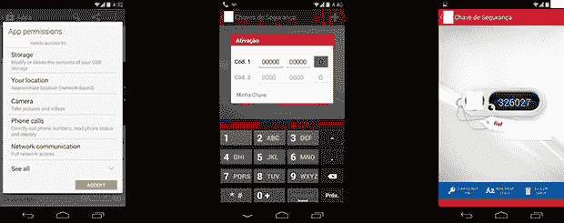

# 对银行的安全令牌进行逆向工程

> 原文：<https://hackaday.com/2014/02/07/reverse-engineering-a-banks-security-token/>

[Thiago]的银行除了使用密码和 pin 以外，还使用一些方法来验证网上和自动取款机上的账户。其中一个是有 70 个一次性代码的“安全卡”，另一个是生成安全令牌的 Android 应用程序。[Thiago]频繁更换手机和 rom，激活这个应用程序成了一件苦差事。这就只剩下一件事要做了:[逆向工程他的银行的安全令牌](http://blog.valverde.me/2014/01/03/reverse-engineering-my-bank%27s-security-token)并建立一个硬件设备来复制应用程序的功能。

从手机上下载了银行的应用程序，然后关掉了。APK 进了一个. JAR，[蒂亚戈]需要为自己生成一个认证码。他发现了一种生成时间戳的方法，时间戳是自 2007 年 4 月 1 日以来 36 秒的间隔数。36 秒的间隔是每个令牌持续的时间，2007 年的日期意味着这部分代码可能是在 2007 年底或 2008 年开发的。逆向工程这段代码允许[Thiago]收集令牌生成过程:它需要一个密钥和当前时间戳。

[Thiago]找到了另一个读取他的手机的 android_id 的类，并从中导出密钥。有了密钥和时间戳，他想出了 generateToken 方法，发现它与 Google Authenticator 的实现非常相似；唯一的区别是时间戳和每个令牌持续的时间。

随着安全令牌的生成完成，[Thiago]开始将这种代码放入硬件设备中。他使用 Stellaris Launchpad 和[scripto suite](https://github.com/Cathedrow/Cryptosuite)和 [RTClib](https://github.com/adafruit/RTClib) 库。硬件不包括实时时钟，这意味着日期和时间需要在每次启动时重置。尽管如此，通过一些添加，[Thiago]可以拥有一个便携式设备，为他的银行帐户生成安全令牌。干得好，这是他的银行非常重视安全性的一个好例子。