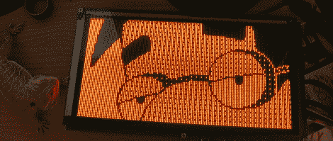

# 等离子体点阵显示器的逆向工程

> 原文：<https://hackaday.com/2012/05/03/reverse-engineering-a-plasma-dot-matrix-display/>

不久前，[DragonMinded]从 Craigslist 上的一个家伙那里捡了一堆旧的街机和弹球零件。这些部件闲置了一段时间，直到在他车库的一个盒子的角落里发现了一个真正整洁的等离子点阵显示器。做着唯一合理的事情，[龙神]想出了如何将这个古老的显示器与微控制器连接起来。

在对他的显示器进行广泛的互联网研究后，[DragonMinded]只能为他的 APD-128G064A-1 显示器找到一页数据表。幸运的是，该数据手册有电压要求，由于显示器只有 6 个输入引脚，他可以探测电路，看看什么连接到哪里。

在生成一个粗略的原理图后，[龙神]用 Arduino 制作了一个驱动电路的原型。当每个引脚的功能被发现后，Arduino 库被丢弃，代之以原始寄存器访问。

这是一个相当大的工作量，但[龙之心]最终达到了他可以在屏幕上画任何他想画的东西的地步。接下来要做的事情是把它变成一个终端或 Twitter 机器，就像所有好的展示技巧一样。