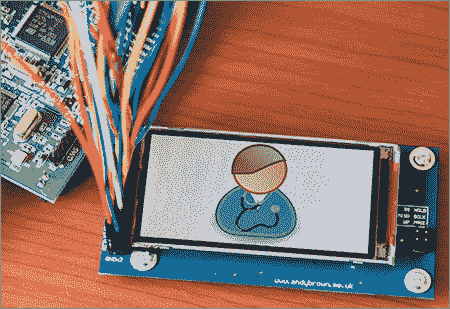

# 对 LG 手机显示屏进行逆向工程

> 原文：<https://hackaday.com/2013/10/08/reverse-engineering-an-lg-cell-phone-display/>

[Andy]在逆向工程 LG KF700 手机显示屏方面做得非常好。LG 的 KF700 是 2008 年的手机——在手机时代已经有 300 年的历史了。这款手机有点新颖，因为它使用了 3 英寸对角线 2:1 480×240 宽屏格式。虽然手机本身可能是一种记忆，但通过 Ebay 的魔力，它的屏幕仍然存在。

获得 LCD 是容易的部分——难的部分是弄清楚如何连接它。LG 在这方面很有帮助，在他们的手机上发布了详细的服务手册和示意图。我们不确定这些手册是否应该是公共领域，但谷歌是你的朋友。在维修手册的帮助下，[Andy]能够确定 LCD 有一个板载控制器(Himax HX8352)，使其更容易连接。他还能够找到有关 LCD 连接器针脚的信息，甚至连接器零件号。

手里拿着连接器，[安迪]开始搭建电路板。他选择的软件是 Protel，这是我们现在所知的 Atlium designer 软件的旧名。了解到大多数人运行的软件与他不同，[Andy]提供了大量关于为微型 LCD 连接器创建足迹的信息。

这个黑客的最后一部分是软件。[Andy]喜欢 STM32 系列，所以他从这些处理器的驱动程序开始。最终产品令人印象深刻。[Andy]还将他的驱动程序移植到 Arduino Mega，但是在 Arduino 和 LCD 之间必须使用 5 伏到 3.3 伏的适配器。[两个驱动程序的软件都可以在【Andy 的】github](https://github.com/andysworkshop) 上获得。

[https://www.youtube.com/embed/XFh_ztxcMsQ?version=3&rel=1&showsearch=0&showinfo=1&iv_load_policy=1&fs=1&hl=en-US&autohide=2&wmode=transparent](https://www.youtube.com/embed/XFh_ztxcMsQ?version=3&rel=1&showsearch=0&showinfo=1&iv_load_policy=1&fs=1&hl=en-US&autohide=2&wmode=transparent)