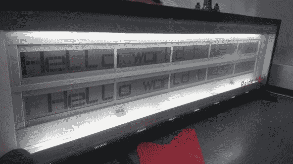

# 逆向工程旧芬兰地铁站显示器

> 原文：<https://hackaday.com/2013/08/19/reverse-engineering-old-finnish-metro-station-displays/>

这个项目绝对是一个耐心的测试。由于赫尔辛基地铁的控制系统当时(现在仍然)在进行大规模翻新，[Konsta]可以以非常便宜的价格(每台 5€)购买三台旧的信息显示器。然而，这些显示器没有任何关于如何驱动它们的信息，因此开始了漫长的逆向工程之旅。

[Konsta]从拆开一个开始，发现显示器的每一边都是由 10 个菊花链液晶显示屏和某种控制盒组成的。正如你可能已经猜到的，逆向工程显示的关键是研究这个盒子的内容。原来，控制电子设备由一个 8085 CPU、一些 RAM、一个外围 I/O 芯片、一个紫外线可擦 EPROM 芯片(包含 32KB 的程序存储器)和一个 e EPROM 组成。

[Konsta]使用 AVR 来转储后两个芯片的存储内容，赫尔辛基黑客实验室也参与了该项目的这一部分。他们一起对控制 PCB 进行逆向工程，研究汇编代码，嗅探不同的板载总线，以完全理解如何控制显示器。

我们强烈推荐阅读[Konsta]的文章，尤其是知道他是专门为我们制作这个英文页面的！