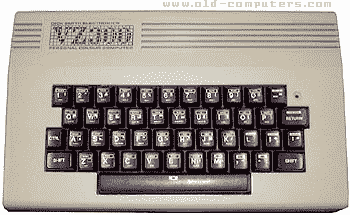

# 逆向工程可编程逻辑

> 原文：<https://hackaday.com/2014/04/02/reverse-engineering-programmable-logic/>

尽管酷孩子在 Hackaday 项目上做了什么，但绝大多数老式计算机都使用某种形式的可编程逻辑来进行内存控制、地址解码和所有其他只需几个逻辑芯片就能完成的事情。这是一个为生产而设计产品的好方法，但是当可编程芯片在 30 年后变坏了会发生什么呢？

[Clockmeister]得到了一台迪克·史密斯 VZ300 计算机(VTech Laser 310 的克隆版),上面有两个坏了的 40 针定制芯片。在浏览了该公司的原理图和工作原理后，[他用 74 系列逻辑](https://www.youtube.com/watch?v=wv7eaFaF7W4&feature=youtu.be)重新制作了定制芯片。

迪克·史密斯 VZ300 是 1985 年的一款相当标准的设备——Z80 CPU，16k RAM，可升级到 64k，磁带机，32×16 字符，8 色显示器。这台计算机内部有两个 40 针芯片，负责视频缓冲和 VRAM 控制、键盘和盒式 I/O、视频定时和单声道扬声器解码。这两个芯片都出现了故障，并且除了从另一个工作单元中清除它们之外，没有备用的。

经过仔细研究，【Clockmeister】用 74 系列逻辑芯片再造了这些芯片内部的电路。新电路建立在一块直接插入空的 40 针插座的板上。这台修复过的电脑里的所有东西都可以工作，所以我们只是把它记下来，作为用可编程逻辑设计新的修复电脑是一个愚蠢想法的另一个原因。对产品来说很好，但不是一次性的。

[图像来源](http://www.old-computers.com/museum/computer.asp?c=980&st=1)