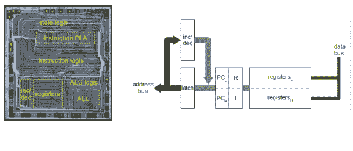

# 逆向工程 Z80 的 16 位递增/递减电路

> 原文：<https://hackaday.com/2013/11/11/reverse-engineering-the-z80s-16-bit-incrementdecrement-circuit/>

递增和递减。它们听起来像简单的函数。但是在微处理器设计中，即使是最简单的功能也会变得非常复杂。Ken Shirriff 写了一篇关于他对 Z80 的 16 位递增/递减电路进行逆向工程的博文。Zilog Z80 是 70 年代和 80 年代最受欢迎的微处理器之一。它被用于许多经典计算机，如[奥斯本 1 号](http://en.wikipedia.org/wiki/Osborne_1)。这些机器通常使用 Z80 来运行流行的 [CP/M 操作系统](http://en.wikipedia.org/wiki/CP/M)。

递增/递减电路负责在正常(非分支)操作期间更新程序计数器寄存器。递增/递减电路还在堆栈操作期间处理堆栈指针寄存器，以及若干其它功能。有人可能想知道，当微处理器有一个大的 ALU 可用时，为什么要使用一个单独的加法器。答案是双重的。首先，ALU 已经在处理用户数学运算。其次，递增/递减电路必须很快。一个通用的 ALU 就是不够快。

一个经典的加法电路是[纹波进位加法器](http://en.wikipedia.org/wiki/Ripple_carry_adder#Ripple-carry_adder)。波纹进位加法器完成了这项工作，但它们很慢。注意，这里慢是以纳秒为单位测量的——电路中没有时钟。整个事情变成了一个经典的组合逻辑优化问题。每一层逻辑都会给电路增加一个门延迟。由于进位必须波动通过所有 16 位，因此在输出端获得最终结果之前有 16 个门延迟。这样的延迟限制了给定电路的最大时钟速度。

Z80 在其递增/递减电路中使用了一些技巧。第一个是[超前进位](http://en.wikipedia.org/wiki/Carry-lookahead_adder)。超前进位电路将直接从输入计算进位值。这可以显著降低门延迟，但需要更多的芯片面积。第二个技巧是[跳跃进位电路](http://en.wikipedia.org/wiki/Carry-skip_adder)。跳跃进位计算成组位的结果，而不是单独计算每个位的结果。同样，它将减少登机口的延误，但代价是房地产。实际的 Z80 实现混合使用了两种电路。还使用了其他几个“辅助”电路。令人惊讶的是Z80 有专门的逻辑来检查内部地址总线上的 1 (0x0001)。该电路在存储器移动循环期间用于通知芯片的其它部分循环即将完成。