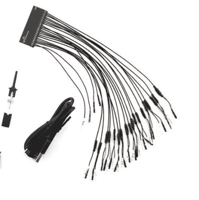
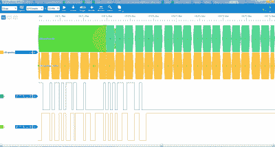

# 复习:DSLogic 逻辑分析仪

> 原文：<https://hackaday.com/2015/05/26/review-dslogic-logic-analyzer/>

历史上，逻辑分析仪一直是工程师武器库中的重炮。对于我们中的许多人来说，这个名字会在脑海中浮现出惠普和泰克的大屏幕。逻辑连接是通过吊舱实现的，数百根导线迂回曲折地回到测试设备。当所有其他方法都失败时，当甚至一个四通道示波器都不足以找出你的问题时，逻辑分析仪出现了。设置它们是一件痛苦的事情——如果你幸运的话，分析仪有一个 PC 键盘接口。如果没有，你就只能在面板键盘上输入你的信号名称。一旦设置好，逻辑分析仪就能很好地发现错误。您可以看到用其他工具看不到的东西——比如读或写选通脉冲后数据总线慢慢稳定下来。

近年来推出了许多基于 USB 的逻辑分析仪，但直到 Saleae 发布了他们的“逻辑”系列设备，它们才真正流行起来。低成本、高速度、易于使用——这些设备是完美的。他们还激发了一大批基于相同赛普拉斯半导体部件的克隆设备。由 DreamSource Labs 设计的 DSLogic 可以被认为是原始 Saleae 设备的开源演变。

DSLogic 于 2013 年作为一个开源逻辑分析仪的 Kickstarter 活动出现，该分析仪带有可选的示波器扩展。我认为可以肯定地说，他们做得很好，筹集了 111，497 美元，是他们最初目标 10，000 美元的 10 倍多。这些天来，在 Hackaday 商店可以买到 [DSLogic](http://store.hackaday.com/products/dslogic) 和[示波器扩展](http://store.hackaday.com/products/oscilloscope-dslogic)。在本次审查中，我们将重点关注该工具的逻辑分析器部分。

点击过去的休息为完整的故事！

## 盒子里面

DSLogic 装在一个精致的多层纸箱里，我惊叹了大约 0.5 秒，然后才撕开它拿起商品。该装置本身是一个扁平(9 毫米高)的铝盒，在结构上类似于 Saleae logic。一端允许探针弹出到它们的. 100 接头上。探针头本身就很了不起。每条数据线其实都是一根超细同轴电缆。在该工具的早期版本中，这种电缆组件存在一些问题。我的是一个更新版本，其中所有的接地是在连接器端的一个小 PCB 上。虽然使用同轴电缆使连接加倍，但在测量速度高达 400 MHz 的数字信号时，正确接地和信号完整性至关重要。

唯一令人失望的是包装中包含的测试剪辑。它们是便宜的那种，由焊接在弹簧钢上的 0.100 针组成。这些夹子的塑料部分容易散架(事实上，有些在运输过程中就已经散架了)，但很容易重新组合在一起。我可以理解 Dreamsource Labs 选择更便宜的剪辑的决定——它们确实有用，只是有点难以使用。考虑到泰克的优质夹子的成本，(每个几美元)，我不能抱怨太多。

## 五金器具

DSLogic 的规格相当不错——最大 400 MHz 采样速率、16 个通道和 256 兆板载内存。当然，你不可能一次完成所有这些。在 200 MHz 时，DSLogic 降至 8 通道，在 400 MHz 时，它是一个 4 通道器件。大部分内部逻辑由 Xilinx Spartan 6 FPGA 处理。在这样的速度下，可编程逻辑是正确的选择。DSLogic 的输入由 ST DVI ulc 6-4sc 6“ESD 保护器件”保护。DVIULC6 是一组箝位二极管，常见于 HDMI 或以太网接口。

## 软件

DSLogic 的软件是 DSView，[目前在他们的网站](http://www.dreamsourcelab.com/download.html)上是 v0.93 版本。该软件基于 [Sigrok](http://sigrok.org/) ，这是用于驱动许多基于 Cypress 的工具的前端。DSView 将其用于他们自己的硬件，而[在他们的 Github](https://github.com/DreamSourceLab/DSView) 上托管源代码。

 任何使用过逻辑分析仪的人都应该熟悉这个软件——尤其是 USB 设备。信号名称和触发器很容易在界面的左侧找到。从 Sigrok 继承的是一套很好的解码器，包括 USB。我通过将 DSLogic 连接到一个通用 USB 转串行板的 data+和 data-line 来测试这一点。我将该板连接到 PC，并捕获 USB 枚举。DSLogic 捕获了数据，DSView 实际上显示了 USB 传输。虽然它不能取代完整的 USB 协议分析器，但这种设置会使调试 USB 硬件比使用示波器容易得多。

我用 DSLogic 测试了许多其他硬件设置，只要逻辑电平是干净的，硬件就能很好地运行。像任何其他逻辑分析仪一样，DSLogic 不是示波器，所以每个边缘看起来都很完美——即使实际信号很糟糕。

DSView 肯定是一项正在进行的工作，但它确实完成了任务。最明显的遗漏是你不能保存一个设置。这也是 Sigrok 的 Pulseview 中的一个问题。除了快速硬件检查之外，这是使用 DSLogic 的主要障碍。在 16 通道设备上设置有意义的信号名称需要时间，更不用说复杂的触发器和解码器了。这个问题变得更加糟糕，因为软件有时会在没有警告的情况下放弃设置。每当我把样本深度提高到超过 DSLogic 的缓冲区大小时，DSView 就会切换到流模式。流模式使用主机的主内存作为缓冲区，但限制为 25 MHz。恼人的部分是，DSView 重置我的解码器和通道回到默认值。

如果 DSLogic 的硬件被移植到 Sigrok 的主线版本中，这一切都可能成为一个争论点。该功能目前在 [wiki 页面](http://sigrok.org/wiki/Supported_hardware)上被列为进行中的工作。

## TL:DR

最后，对于分析数字信号，DSLogic 是一款不错的开源硬件。不过，软件方面确实需要做一些工作。从 DSView 的 Github repo 来看，变化正在发生，尽管很慢。由于这是一个开源项目，也许社区中的某些人会受到启发来帮助 DSView，或者更好的是，将 Dreamsource Labs 的更改合并到主线 Sigrok 项目中。