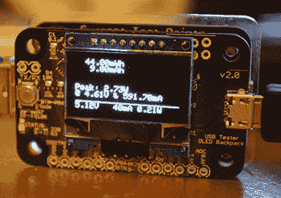
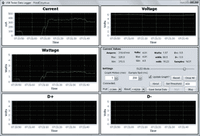
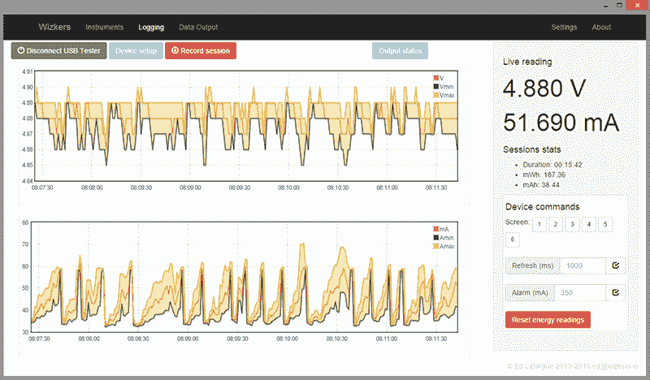

# 复习:FriedCircuits USB 测试仪

> 原文：<https://hackaday.com/2015/06/19/review-friedcircuits-usb-tester/>

在过去十年左右的时间里，USB 不知何故发生了变化。它不再仅仅用于连接打印机、键盘、鼠标和网络摄像头。它甚至不仅仅是你可以插入串口的东西。这是一个*电源插座。*如果你想给手机充电，把它插到一个最高能输出 2.5 瓦的电源插座上。我猜是意料之外的后果。如果你发现自己又回到了 1995 年，去找英特尔，告诉他们提高电流限制。

作为一个电源插座，有一个设备来测量电流，电压，功率，以及 USB 电缆内发生的所有其他错综复杂的事情将是整洁的。来自 Fried Circuits 的 [USB 测试仪就是那个设备。](http://store.hackaday.com/products/usb-tester-2-0)

Fried Circuits USB tester 与其说是一个单独的设备，不如说是一套小型工具，可以让你探测 USB 电缆内部发生的一切。[最简单的形式](http://friedcircuits.us/tools/50)，它只是一个电路板，一端有一个 USB A 连接器，另一端有一个 USB 微型连接器，以及用于测量电流、电压、差分数据信号的分线点，还有一个奇怪的 ID 引脚，如果你使用 USB 充电器或 OTG 设备，这很有用。

这个分线板也有两排五个分线针。那是给 [USB 测试器背包](http://friedcircuits.us/47?search=USB)的，它真的是这个设备的心脏。这款背包具有一个微控制器和一个 128×64 分辨率的有机发光二极管显示器，用于电流、电压和功率监控，读取数据线上的电压，并在显示器上绘制一切。你想知道的关于 USB 端口的一切——当然，除了实际插入的位——都在显示屏上。按几下侧面的按钮，你需要的任何信息都会以清晰易读的数字显示出来。

#### 买一个的全部原因

如果你只打算用它来观察流经 USB 电缆的电压、电流和电流，那么你就是在用这个 USB 测试仪浪费钱。如果简单，一目了然的监控是你所需要的，[你可以上亚马逊](http://www.amazon.com/gp/product/B00JIFMXSK)花 15 美元买一个 USB 电流/电压表。[就连阿达果也有一个](http://www.adafruit.com/products/1852)，售价 7.50 美元。如果你只需要读取 USB 设备的电压和电流，你的钱最好花在别的地方。

The Fried Circuits Java app.

油炸电路 USB 测试仪做一些其他 USB 米不能做的事情。它可以通过 USB 将所有数据记录到电脑中。

[在我对 Hackaday 商店的 USB 测试器的最初评测](http://store.hackaday.com/products/usb-tester-2-0)中，将测试器中的数据记录到电脑中的唯一“官方”选项是一个 Java 应用程序。USB 测试器的开发者[Will]选择了 Java，因为 Sun 和 Oracle 在过去 20 年里一直向我们灌输“一次编写，随处运行”的理念。理论上，Java 是 USB 测试器数据记录解决方案的绝佳选择。

然而，在实践中，它就是不起作用。[Will]自己承认，这是他用 Java 做的第一件事，我认为他在 NetBeans 中设置了一些错误的选项。我无法让数据记录应用程序在我的 Windows 8 机器、OS X 机器或 Linux boxxen 上运行。我运行这个应用程序的唯一方法是翻出一个旧的 XP 盒子。显然，[Will]的 NetBeans 副本是为 Java 5 之类的配置的。

【威尔】知道这个问题，上个月他正式与 [wizkers.io](http://www.wizkers.io/) 的【爱德华·拉法格】合作。这是一个运行在 Chrome 应用程序中的科学仪器平台。在 Chrome 应用程序中选择运行 instrumentation 可能看起来很奇怪，但这显然是新的热点；[你可以在 Chrome 应用](https://codebender.cc/)中编写一个 Arduino，在这个领域有很多有趣的事情发生。

您可以[在这里试用 Chrome 应用程序](https://chrome.google.com/webstore/detail/wizkers/lmagnikfjbomgbfddfmldacfafnglbej)，使用 USB 测试器，一切都按预期运行:

The Wizkers.io app.

Wizkers.io 应用程序可以完成你对数据记录应用程序的所有期望。它会告诉你当前被测设备的电压、电流、瓦特、mWh 和 mAh。有漂亮的图表，一切都可以下载到电脑上做进一步的分析。

用第三方应用程序来审查这款设备可能看起来像是作弊，但[威尔]自己承认，基于 Java 的记录器存在问题，而 Chrome 应用程序运行完美。具有讽刺意味的是，Chrome 应用程序比用 Java 编写的应用程序更易于移植。我很感激。

当然，USB 测试器也通过串行连接输出这些数据(也是 JSON 格式！).如果你只是想把它连接到电脑上，把一些电线焊接到 TX 和 RX 线上。

#### 结论

如果你想要一个只告诉你一个 USB 设备吸了多少毫安的设备，你不需要这个。你可以花不到 10 美元买些东西来告诉你。如果您正在开发一些 USB 硬件，您最终会想要描述您的设备消耗了多少功率以及何时消耗了那么多功率。这将需要一个数据记录工具，除了切断一些 USB 电缆并将其连接到一个昂贵的电源，你不能比 Fried Circuits USB 测试仪做得更好。