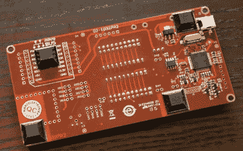
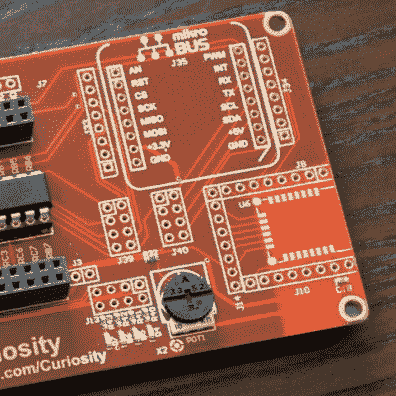

# 回顾:Microchip Curiosity 是一款华丽的新 8 位开发板

> 原文：<https://hackaday.com/2015/07/22/review-microchip-curiosity-is-a-gorgeous-new-8-bit-dev-board/>

微芯片推出了一款新的开发板，名为[好奇号开发板](http://www.microchip.com/Curiosity)。我第一次看到这个是在五月份的湾区制造商大会上，但是被要求不要公开这个硬件，因为它还没有正式发布。昨天，我拿到了第一个“试点项目”演示单元，并花了一些时间使用它。

出于我自己的好奇心，我要求一个样板。您可能知道，Microchip 是 2015 年 Hackaday 奖的赞助商之一，但该合作伙伴关系不包括本次审查。然而，由于我们确实有这种关系，我们问他们是否会额外赠送几块电路板，他们答应了。更多信息请见文章末尾。

## 概观

我没有真正做过任何图片开发。我从 Atmel 芯片开始，因为你可以用并行端口对它们进行编程。那是 Arduino 出现之前的日子，在确定我喜欢这个芯片家族之前，我不想投资一个合适的程序员。这在当时用微芯片微控制器是做不到的——或者至少引导程序员更难——因为他们在编程时需要 12V 电源。“高压”信号是由 PICkit 或类似的编程器提供的。我认为好奇心是解决这个问题的好方法。它使用 PKOB-pick it on board-进行编程和调试。

好奇号在电路板的中间有一个 DIP 插座，两侧各有一个插脚插座。该板内置了一个程序员/调试器，这意味着只需添加一根 USB 电缆和计算机，您就可以启动并运行了。这个设置让我想起了 TI 的 MSP430 Launchpad 板，我真的很喜欢那个。

加工引脚接头可容纳 PIC12、PIC16 和 PIC18 系列 8 位处理器的 8、14 或 20 引脚芯片。我收到的早期版本配有 PIC16F1708，但我被告知生产版本将配有 PIC16F1619。如果这不是你要找的芯片，他们在好奇心页面的“支持的设备”标签上列出了每个芯片的样品请求按钮。能够尝试一堆不同的 8 位芯片，并在此板上进行交换，这是一个让您尝试的完美方式。

## 钻研细节

我的主板底部有四个橡胶脚，可以很好地放在工作台上(并使底部远离杂散导线和其他导电碎屑)。对于用户输入，有一个按钮、一个电容式触摸按钮和一个电位计。用户按钮和下面的脚的位置是可疑的。由于按钮在脚的外侧，如果不按住对角，按下按钮会使整个板倾斜。我问过这个问题，Microchip 在他们的测试中也有同样的问题。生产板将在四个角安装支架(前 500 块板为金属支架，大规模时可能为塑料支架)。很高兴看到他们正在努力在这些信息公之于众之前覆盖所有的基础。

  PKOB programmer/debugger on bottom side of board.  Top footprints for mikroBUS and BTLE module

板的角是圆的，边缘是我在开发板上感觉到的最光滑的。芯片和分线接头左侧的空间由位于电路板下侧的编程器/调试器电路使用，其顶侧有一个占地面积，可为 9V 输入添加一个可选的筒式插孔(这将由现有器件调节)。还有一对集管，用于连接执行自身调节的台式电源。

在电路板顶部的右侧，有两个用于附加硬件的封装。一个是针对 [RN4020 BTLE 模块](http://www.microchip.com/wwwproducts/Devices.aspx?product=RN4020)的专用设计。另一种封装使用[mikroBUS 引脚排列标准](http://www.mikroe.com/mikrobus/)。我以前听说过这个名字，但这是我第一次研究它。一些 Hackaday 工作人员已经看到了该标准的实际应用，并提到它在欧洲更受工程师的欢迎。至少，它是一组间隔为 0.1 英寸倍数的 SIL 轮廓，因此您可以将模块插入试验板(不像 Arduino shield 标准)。最好的情况是，微芯片接受了一个已经存在多年的标准，而不是试图发明自己的标准。它有很好的文档记录，因此您可以构建自己的模块或使用许多不同公司已经上市的模块。

也许这种设计最棒的部分是他们为了让所有的引脚都可用而付出的努力。每一个引脚被路由到特定功能封装(麦克风、用户按钮、led、电容垫，但不是 BTLE 接头)的地方，都有一个获取信号的简单方法。

右边是棋盘底部的特写。您可以看到 DIL 接头，每行的焊盘通过零欧姆电阻连接在一起。剪断或拆下这些跨接电阻，断开元件。这比在电路板上切割走线要好，因为您可以用引脚填充封装，并使用跳线来恢复原始功能。不错吧。

## 程序设计经验

我下载并设置了 MPLABX IDE。感谢 Microchip 拥有 Linux 版本(如果 Cypress 能为 PSOC4 做同样的事情就好了！).从好奇心页面打开示例代码后，我选择了附带的编译器，并选择了程序员类型，但无法构建示例。通读[好奇号用户指南](http://www.microchip.com/mymicrochip/filehandler.aspx?ddocname=en574887) (PDF)，我发现我需要下载并安装免费版的[XC8 编译器](http://www.microchip.com/pagehandler/en_us/devtools/mplabxc/)。在那之后，我没有问题建设和闪光的例子。IDE 第一次甚至对 PKOB 编程器进行了自动固件升级。这绝对是我经历过的最简单的工具链设置之一。

一般来说，我会避免使用专有的工具链(我也很享受不通过制造电子产品谋生的生活，所以一点点麻烦不是什么大不了的事情)。我做了一些快速搜索，我不认为你可以为这个特定的芯片(PIC16F1708)使用 SDCC 开源编译器，但该编译器支持其他芯片，我不明白为什么这个程序员不能使用开源编程工具。只是在发表这篇文章之前没有时间去测试。

## 结论

这是一款构思巧妙，设计精良的开发板。交换芯片的能力，以及提供 IO 引脚接入的额外分线面积，使其成为所有架构中最灵活的开发板之一。我喜欢极简的“铃铛和哨子”,所以一个按钮和四个 led 的加入击中了我的甜蜜点。对于那些不想花 50 美元购买独立的 PICkit 3 程序员的人来说，这是一个安全的赌注。拥有编程和调试选项意味着这将是一个很难超越的工具。

* * *

## 先下线 15 个中的一个

大多数主要经销商都有 Microchip Curiosity dev 板上市，但他们都没有股票。但是因为我们想要一个，并且已经和 Microchip 有了良好的关系，我们问他们是否有额外的东西给 Hackaday 的读者。前往 [the。堆栈帖子](https://hackaday.io/page/1116-win-the-curiosity-board)了解详情。

## 与好奇号的设计师聊天

“好奇号”的电路板是由约翰·木桐和微芯片的一个天才团队共同设计的。[John]将[加入我们的现场聊天](https://hackaday.io/event/6815-pcb-design-engineer-chat),讨论项目的进展。把它加到你的日历上，开始思考你可能想问的问题。