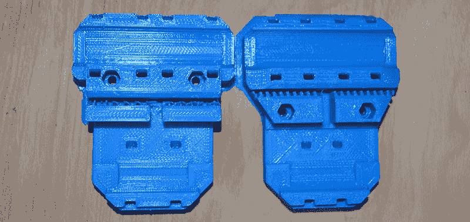
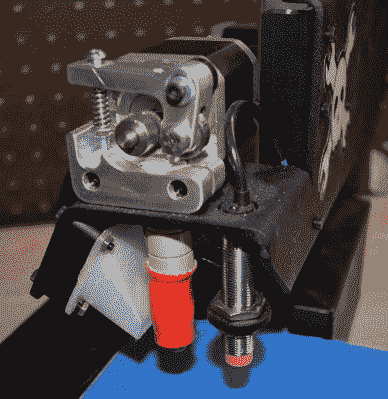
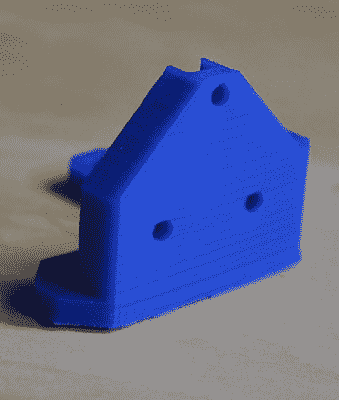

# 点评:Printrbot 组装简单金属

> 原文：<https://hackaday.com/2015/04/17/review-printrbot-assembled-simple-metal/>

Hackaday 正在重新开始做评论，随之而来的是对当今工具 3D 打印机的评论。我对评论 3D 打印机有所保留；它们是一种新技术，今天可能是标准的东西可能在几个月后就会过时。还记得齿轮挤压机吗？显然，新的热点是直接驱动挤出机。

这是对组装简单金属的 [Printrbot 的回顾。如果你需要任何证据来证明 3D 打印机的评论有保质期，你只需要看看这款打印机的](http://printrbot.com/product-category/3d-printers/simple-metal/)[入门指南](http://help.printrbot.com/Guide/1.+Unboxing+Your+Assembled+Printrbot+Simple/117)。我买我的 Simple Metal 的时候，Printrbot 推荐的软件栈是 Slic3r 和 Repetier-Host。仅仅三个月后，Cura 就成为了 Printrbot 推荐的软件栈。如果你认为一个简单的软件变化无关紧要，看看下面这些图片:

Prusa i3 X-carriages. Left sliced by Slic3r, right sliced by Cura

左边的指纹用 Slic3r 切片。右边的照片是用 Cura 切片的。请注意每张照片上的小齿，这些齿抓住了同步带。有了 Cura 切片打印，一切都好了。Slic3r 切片打印完全失败，不是机器的问题，而是机器推荐的软件的问题。

因此，如果写评论的目的是对一件设备有一个明确的看法，那么必须解决一些问题。既然大部分 3D 打印软件都是开源的，那么软件是否应该纳入审查范围？3D 打印机的价值主张仅仅是价格对产量的作用(这似乎是现在的标准衡量标准)，还是有无形的东西？审查应该包括开箱即用的打印质量，还是应该在几十个小时的调整后只关注打印质量？我根本不知道这些问题的答案，我怀疑你无法让任何两个人对这些问题的答案达成一致。

也就是说，我觉得我已经用了足够多的时间来判断这台打印机是否值得购买。

### 设置

我的金属简易包裹通过 UPS 送达，装在一个非常漂亮而普通的纸箱里。Printrbot 的包装有点像一件艺术品，这应该足以保护机器人免受运输损坏，而不会装满浪费的泡沫聚苯乙烯。Printrbot 公司有人在包装设计方面有经验，我不得不为此脱帽致敬。

正如我上面所说的，很难对一个在短短几个月内完全改变的产品的某个方面进行评论，但是由于 Slic3r 的一些糟糕的打印，我可以为两个软件栈的设置提供反馈。

对于 Repetier-host 来说，设置是轻而易举的。官方指南和视频将带您完成校准 Z 轴高度、打印几个校准立方体以及最终打印功能部件(更复杂打印所必需的风扇罩)的过程。

库拉是一个完全不同的野兽，但在许多方面比 Repetier-host 更好；所有的东西都在一个面板里，切工*很棒，*所有的印刷出来都很棒。

当打印更大更长的照片时，我建议不要在主机软件中查看打印进度。使用 Repetier 查看正在进行的打印时，串行端口会出现一些问题。这些问题不会导致打印失败，但会显著增加打印时间。我留下了 12 个小时的打印通宵，当我早上回来时，ETA 增加了两个小时。把 Repetier 留在温度图上，就不会有这个问题了。

### 五金器具

Printrbot Simple Metal 使用直接驱动挤出机、风扇和 Printrbot 设计的 Ubis hotend。这种 hotend 的特点是一个镍铬合金丝加热器缠绕在一个铜管上，通过一块 PEEK 与挤出机隔开。从各方面来看，这是三四年前的设计。现在流行的设计是全金属的 hotend，除了通常的 ABS 和 PLA 之外，它还能挤出尼龙和其他奇特的塑料。

Printrbot [确实提供了全金属的 hot and](http://printrbot.com/shop/metal-ubis-hot-end-2/)，令人惊讶的是价格[比老款](http://printrbot.com/shop/1-75mm-ubis-hot-end/)更低。简单的金属仍然与旧的设计一起运送。据我所知，没有 Printrbot 配备较新的全金属 hotend。我觉得这很奇怪，不仅因为与全金属 hotend 搭配得最好的“奇异”灯丝越来越受欢迎，还因为全金属 hotend 的生产成本显然比旧型号更低。如果你想要一个预警，那就来吧。要用奇异的细丝打印，你要花 50 美元升级你的机器。

Printrbot 确实有一个有趣的功能，它被固定在机器的热端旁边。这是感应床传感器，或 Printrbot 在开始打印前设置 Z 高度的方式。是的，Printrbot 有自动调平功能，从我和 Mendel 的经验来看，这是天赐之物。床传感器[的设置确实需要一些时间](http://help.printrbot.com/Guide/4.+Using+Cura+to+Set+Up+Your+Auto-Leveling+Probe+and+Create+Your+First+Print/190)——在我的例子中，大约一个小时。完成后，z 探针偏移保存到电路板上，就大功告成了。如果指纹的第一层粘在床上，你的指纹就不会有问题。

### 打印质量

Striations on the Z axis. You’ll only get this by using a threaded rod for Z axis movement.

在大多数情况下，Printrbot 简单金属的打印质量正是您所期望的。对于第一次购买 3D 打印机的人来说，它会显得很神奇；将一个对象加载到 Repetier 或 Cura 中，按下 print，几个小时后就会出现一个对象。借助 0.4 毫米的喷嘴，您可以像其他任何打印机一样打印塑料。借用一句话，就是管用，效果看起来不错。

然而，在简单金属的设计中有一个明显的缺陷。它使用螺纹杆来移动 Z 轴。如果你看看 Lulzbot 和 Ultimaker，这曾经是——现在仍然是——在 Z 轴上移动的标准方式。如果你打印一个高而光滑的物体，你会注意到规则的条纹。这是一个不受约束的螺纹杆的人工制品，在有一点点抖动的地方，你会在你的打印中看到模糊的线条。你感觉不到它们，但它们就在那里。

这种机械怪异的假象可以通过皮带或另一种线性运动系统来减少甚至消除；这些条纹在 delta 机器人中是看不到的，这仅仅是由于机械装置的原因。抱怨一种几乎看不见、极难拍摄的现象似乎很傻，但效果是存在的。

### 客户支持和供应链

啊，评论里我是个白痴的部分。故事时间:我把我的打印机搬到了我的工作室/地下室/一堆旧电脑里。我的 USB 接口快用完了，所以我在我的垃圾盒子里找到了最近的集线器，找到了电源，把所有东西都插上了。连接到集线器的是我的手机、一个树莓 Pi(都只是为了供电)、一个 Teensy、Printrbot 和我的 MacBook Pro(连接到主机端口)。我抢到的电源适配器是 12V 电源。我从没说过我聪明。

由于我自己的愚蠢，我现在有一个死了的 Printrbot 控制板 Printrboard。然而，我没有一个死了的手机，一个死了的树莓派，或者一个死了的 Teensy——这些东西在事件发生时也插在了集线器上。印刷电路板的工程符合规范，就像连接到集线器的其他所有东西一样。这说明了我认为 Printrbot 最大的问题:供应链和客户支持。

在 Windows、Linux 和 OS X 下尝试寻找设备失败后，我尝试重新刷新固件；芯片已经完全报废了。虽然这是我的*错误，*其他设备在相同条件下的存活率表明这是 Printrbot 的*问题*。我向他们的支持系统发送了一张票，经过一点来回之后，有人建议我给[买一张新的印刷纸板](http://printrbot.com/shop/printrboard-rev-f/)来替换那张坏了的。

这个计划有个问题。在过去的三周里，Printrbot 商店里的 Printrboard 已经脱销了。我已经注册了当印刷纸板重新进货时得到通知，三个星期以来，我一直在等待一封电子邮件。

这不是消费者经常面临的情况。我想给某人钱，但他们不会接受。很奇怪；等待一个替换零件(至少是一名客户支持技术人员建议的零件)近一个月的奇怪感觉如此奇怪，以至于我认为我需要坚持到底。是的，我可以用 RAMBo 或 RAMPS 控制器来替换主板，但此时我很喜欢搞砸供应链和库存管理。

### 结论

这篇评论的标题应该是:“好的打印机打印更好的打印机”。Printrbot Assembled Metal Simple 是我的第一台打印机；刚好够你进门。如果没有加热床，你只能用 PLA 细丝打印，除非你非常好或者 T2 非常幸运，大底的打印品会有卷曲的边缘。这可以通过用 rafts 打印或者花一个周末把打印机调至完美来缓解。没有升级，Printrbot 将不会打印奇异的细丝。在我看来，Printrbot Simple Metal 不是一台 600 美元的打印机——它是一台 600 美元的打印机，最终需要 100 美元的加热床、50 美元的 ATX 电源和 50 美元的金属热端。花 800 美元，你就可以得到一个加热床，更大的体积，和一个不用丝杠驱动的 Z 轴。

这是一台很棒的第一台打印机，但是如果你认为你可能想要一些东西——特别是考虑到 Printrbot 无法保持组件和附件的库存——请到别处看看。如果你正在寻找一台便宜的打印机，请记住*你可以打印另一台 3D 打印机*。通过我的机器的第二卷灯丝专用于 i3 部件。我强烈建议购买 Printrbot 的人在第一个月内打印 3D 打印机的零件。

在我写这篇评论的时候，Printrbot [宣布了他们即将推出的 Printrbot Play](https://twitter.com/printrbot/status/588560579620515840) ，这款机器似乎可以解决这篇评论中提到的大多数问题。在该剧的单一画面中，似乎会有一个金属热端，并且很有可能减少 Z 轴的抖动。

我想我会在几个月后回顾这一点。一分钱一分货…