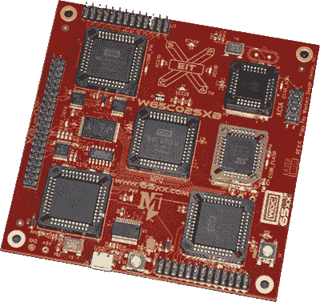
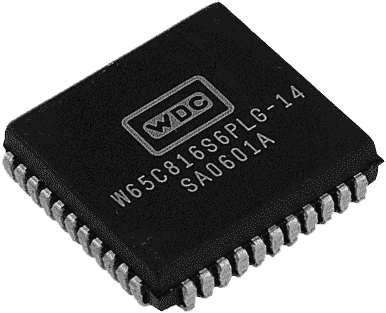
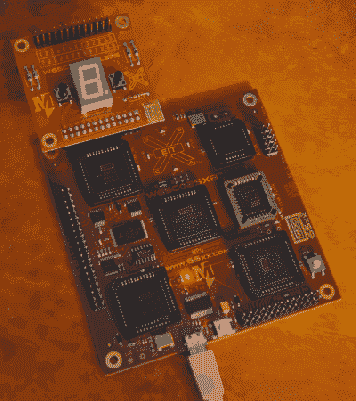
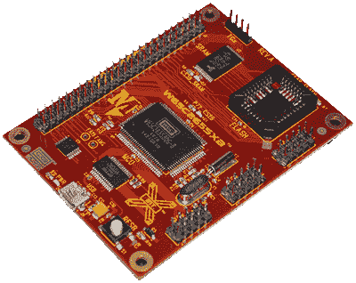
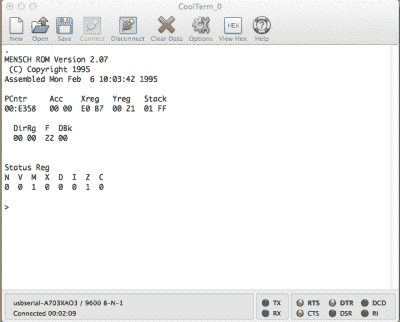

# 复习:单板 65C02 和 65C816 计算机

> 原文：<https://hackaday.com/2015/07/29/review-single-board-65c02-and-65c816-computers/>

6502 是计算史上的经典之作。从 Apple ][，到任天堂娱乐系统和 Commodore 64，这种 CPU 的版本随处可见。6502 的历史不会随着视频游戏而结束；在过去的四十年里，这种 CPU 已经进入了工业设备、医疗设备和其他不需要每两年重新设计的设备。将 6502 的长寿与整整一代开发人员首次使用 6502 组装这一事实结合起来，你就拥有了一个经典微处理器的气质，我相信它在下一个四十年里仍然适用。

6502 大教堂是[西方设计中心](http://www.westerndesigncenter.com/wdc/)。35 年来，WDC 一直是 6502 相关设计的发源地。最近，WDC 对 6502 的教育方面很感兴趣，其中一名副总裁【大卫·克莱默】[将他的时间借给了一个课后俱乐部，教授操作码](http://www.durangoherald.com/article/20150331/NEWS05/150339921/Park-Elementary-kids-go-high-tech-#)。

WDC 的人最近联系了我，看我是否能仔细看看他们的硬件，在提供了几块电路板后，这个硬件被证明是非常棒的。对于敢于背离 Arduino、Processing 和 Fritzing 时代精神的教育工作者来说，以及对于想要涉足 65xx 开发世界的任何人来说，它们都是非常棒的。

### 单板计算机

WDC 送我的是 W65C02SXB 和 W65c816SXB，分别是基于 65C02 和 65C816 的两款单板电脑。

 对于基于 65xx 的计算机，互联网上流传着数百种有据可查的设计，但这些设计大多有很多共同点。如果你想建造自己的基于 6502 的计算机，你需要一个 CPU，一些内存，一个 EEPROM 或闪存芯片。对于外围设备，你会看到 6520 PIA，一个提供两个 8 位 I/O 端口的芯片，6522 通过一个更先进的 I/O 芯片，带定时器和移位寄存器，如果你是一个纯粹主义者，可能还有 6551 ACIA 通信/串行芯片。这是基于 6502 的计算机的标准芯片，如果你相信【查克·佩德尔】，[没有这些支持芯片](http://www.theamphour.com/241-an-interview-with-chuck-peddle-charismatic-chipmaking-coryphaeus/)，6502 就没那么有用。

WDC 基于‘02 和‘816 的单板计算机都具有一个 ACIA、一个 PIA 和两个过孔——第二个过孔连接到为 WDC 的铽 IDE (TIDE)设计的 microUSB 接口。一会儿再来。每个主板还具有 32kB 的 SRAM 和映射到顶部 32k 内存的 128kB 闪存芯片。对于几乎每台家酿 6502 计算机来说，这是一个相当标准的布局，但是有几个特点使这种板很特别。您需要的每一个引脚——数据、地址、控制和一些芯片选择——都可以在贯穿整个电路板的接头上找到。如果你想把 SXB 和一些旧硬件连接起来，这很好，但是创造新硬件的潜力很有趣。当我在 WDC 与[大卫·克莱姆]和[大卫·格雷]交谈时，我们推测可以制造什么有趣的硬件来支持这个巨大的头。对于四轴飞行器来说，电路板可能太大太笨重，但是 3D 打印机控制器电路板是完全合理的，可能会工作得很好。

### 65C816

西方设计中心不只是处理 6502 和它的支持芯片。它仍然是你能得到 65C816 的唯一地方，一个建立在 6502 ISA 上的极大扩展的 CPU。

816 是一款*非常*有趣的芯片，因其在苹果 IIgs 和超级任天堂中的应用而闻名。它有一条 24 位地址总线，支持 16 兆的 RAM，有 16 位寄存器，在 6502 上有一些新指令。最令人印象深刻的是，当你第一次打开 65C816 时，它以 6502 仿真模式启动，与 6502 完全兼容，直到你翻转“隐藏”寄存器中的一位。

有了新的堆栈指令和与 65C02 的兼容性，你会想如果 65C816 早几年推出会发生什么。该芯片于 1984 年完成，正好赶上苹果在 IIgs 中使用它，也让比尔赫德意识到，“使用它的原因是因为竞争对手正在使用它，这不会是一个成功的宣传。”几年前，这种芯片至少会在 Apple Lisa、Macintosh、Atari ST 系列甚至 IBM 个人电脑的最初设计中得到考虑。这是计算史上最大的假设。

在过去的 30 年里，WDC 一直是 65C816 火焰的守护者，当然他们的教育产品[包括基于这个芯片](http://wdc65xx.com/boards/w65c816sxb-engineering-development-system/)的单板计算机。它与 W65C02SXB 基本相同，具有 PIA 分线点、VIA 分线点和 ACIA 分线点。较大的一组连接器包含 W65C02SXB 的 XBus02 连接器的所有数据、地址和控制线，除了用于额外地址线的额外引脚。

最重要的是，使用 65C816 开发板，无需处理多路复用数据和地址线。编写 816 代码就像把电路板插到你的电脑上，然后敲击键盘一样简单；毕竟，西方设计中心拥有唯一的现代 816 C 编译器。

### Terbium IDE

The Sample Project for the SXBs blink a seven-segment display in a pleasing pattern

所有 WDC 板都与铽 IDE 一起工作，该 IDE 与 WDCTool 套件打包在一起。这是编译器、链接器、你选择的编辑器和模拟器的接口。说实话，它并不完全是一个*现代*IDE——它只适用于 Windows，我的战斗工作站(Win 8.1)在 WinXP Sp2 兼容模式下运行的效果最好。

虽然 TIDE 有点粗糙，但将它与 Visual Studio 或 Eclipse 相比并不公平；与为单一平台构建的 IDE 相比，这些高端 IDE 总会有更多的功能和更多的改进。此外，它是一个 IDE，边缘粗糙是*默认的*，而不是一个例外。

除了编译和链接之外，TIDE 还有另一个可以直接应用于 SXB 主板的优秀特性:一个模拟器和调试器。

The TIDE simulator/debugger running the sample project with a seven-segment display

如果您构建自己的 6502 单板计算机，在 TIDE 中添加模拟器和调试器是不可能的。使用模拟器和调试器，您可以单步执行代码，设置断点，以及通常使用嵌入式 IDE 所能做的一切事情。

[w65c 02 sxb](https://github.com/WesternDesignCenter/W65C02SXB-Demo7Seg)的示例项目是一个“用通孔点亮七段显示器”教程，这展示了调试器的潜力；它甚至在一点代码的帮助下模拟了七段显示。

在 TIDE 中有一些额外的功能，这些功能与 WDC 的 02 和 816 软核的 FPGA 相关内容相关，但由于这远远超出了我所拥有的主板，这些按钮被单独留下。

### 微控制器开发板

The W65C265SXB – A microcontroller board based on the 65C816

40 年来，WDC 没有固步自封。他们的教学工具还包括基于 65c02 和 65c816 的微控制器。这些是 [65C134SXB](http://wdc65xx.com/boards/w65c134sxb-engineering-development-system/) (基于 02 款，最初设计用于生命支持)，和 [W65C265SXB](http://wdc65xx.com/65xx-store/sxb-boards/w65c265sxb-engineering-development-system/) (基于 65c816)。

每块板都配有 W65C134S 或 W65C256S 微控制器，带 32kB SRAM，一个 32PLLC Flash ROM 插座，一个与其“全微处理器”大致相同的大型连接器，以及三个用于基本 I/O、串行接口总线和 UART 信号的 10 引脚连接器。

虽然这些微控制器开发板看起来非常小——毕竟只有四个芯片、一手无源器件和一堆引脚——但外表是有欺骗性的。微控制器实际上是不可思议的工程设计，真的无法与市场上的其他任何东西相提并论。

The W65C265SXB ROM Monitor running in a terminal emulator

这两个微控制器内部都有一个 ROM 监视器，其功能就像古代计算机中的任何监视器程序一样。使用这个监视器，您可以读写内存地址，跳转到地址，并运行代码。所有需要的是一根 USB 电缆，一个终端仿真器(CoolTerm，Putty，[一个整洁的小 Python 脚本](https://github.com/WesternDesignCenter/TerminalPython)，或者任何其他可以通过串行端口连接的东西，9600，8 n1)【Rod Biresch】有[一个很棒的教程，教你如何将操作码输入到‘265 sxb](https://rodbiresch.wordpress.com/2015/06/30/blink-the-led-hello-world/)中以使 LED 闪烁。是的，这是使用微控制器可以做的最基本的事情，但它确实有效，可以作为嵌入式 65xx ISA 微控制器更复杂应用的第一步。

像他们的大兄弟一样，他们也得到了 WDC 自己的开发环境 TIDE 的支持。有了这个，你可以把汇编或 C 语言扔向这些小板子，它们就会突突前进。

### 结论

WDC 的单板计算机有一个相当大的缺点——价格。W65C02SXB 和 W65C816SXB 的价格略低于 200 美元。微控制器的变体 W65C134 和 W65C265 比它们的同类产品便宜 100 美元。当你花 2 美元就能买到一个免费送货的 Arduino Nano 克隆时，乍一看这看起来很疯狂。想了想，我不相信价格真的是疯狂的。

虽然你可以从任何旧电脑中取出 6502，但除了 WDC，你不会从任何人那里找到新的芯片。参与 6502 游戏是一项相对较低的业务，对于每一个经典的微处理器，都有数以千计的 ARM 芯片。

也就是说，如果你要构建一个 6502 或 65816 单板计算机，你也需要这些过孔和 PIAs 再说一次，不是一美元就能买到的筹码。我已经*建造了*一台基于 6502 的计算机，就成本而言，我的建造并不遥远。如果你考虑到构建自己的 SBC 所付出的努力，那么，你认为你的时间有什么价值呢？

WDC 电路板的微控制器版本是他们最感兴趣的产品。现代 6502 版本中有一个常见的比喻，即将几乎所有内容卸载到微控制器，但保持 6502 的经典 40 引脚 DIP 格式。你已经看到用螺旋桨完成[，用](https://hackaday.io/project/3620-l-star-minimal-propeller6502-computer)[一个 ATMega](http://hackaday.com/2013/10/21/the-most-minimal-homebrew-computer/) ，再用螺旋桨完成[。65C134 和～265 在这方面做得特别好，它们有一个内置的监视器，可以让你快速输入机器码。这是每台自制电脑的目标，真的。](http://hackaday.com/2014/06/01/propeddle-the-software-defined-6502/)

作为一种教育产品，WDC 的单板计算机完全按照它们的设计来做:让人们学习汇编、操作码和机器码。这仍然有价值，尤其是如果你打算继续在 Arduinos 和 arm 上进行黑客攻击的话。微控制器板是对一些非常有趣的硬件的很好的介绍，我迫不及待地想看到复古/自制场景深入到这些机器的一些严重的修补。