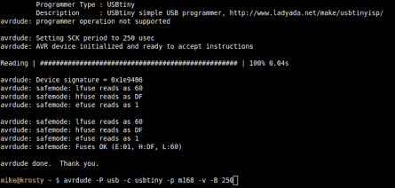

# 回顾:AVR 的 UISP 程序员

> 原文：<https://hackaday.com/2015/05/09/review-uisp-programmer-for-avr/>

我涉足 AVR 芯片是因为它们易于编程，随着程序员成本的不断下降，这一点变得越来越真实。但是，当烧芯片上的保险丝时，很容易犯错误，如果你没有一个合适的程序员(我的第一个程序员是一个非常慢的自建 DAPA 电缆)，你会有一个砖头在你手上。这个小板子也许能在那种情况下有所帮助。本周我尝试了一下 USB ISP。半根口香糖大小的板像冠军一样闪烁固件，并包括一个救援引脚，当你有时钟源问题时。

下面是我的完整评论。ISP [的所有技术信息可在用户指南](http://www.geppettoelectronics.com/2014/08/usb-isp-user-guide.html)中找到。板子本身[现在可以在 Hackaday 商店购买](http://store.hackaday.com/products/usb-uisp)。

在这里，它被用作 ATtiny84 芯片的系统内编程器。编程器给目标供电，并有一个在 3.3v 和 5v 之间转换的开关。原理图中的 AP2331 提供过电流和反向电流保护。

该板由我们的朋友[Nick Sayer]设计，基于[Dick Streefland]的 USBtiny 程序员。使用程序员参数“usbtiny”完全支持 AVR Dude 编程。我不需要做任何事就能进入董事会。当通过 USB 插入时，它在我的 Linux Mint 17 系统上枚举为:“1781:0c9f 多厂商 USBtiny”。由于 AVRdude 端口参数“usb”有效，所以权限没有问题(有时我需要 udev 规则用于 USB 程序员)。

它配有一个用于 6 针 ISP 连接的屏蔽接头，以及 IDC 电缆，该电缆在塑料外壳中有一个键，以确保电缆正确插入。我很欣赏电路板背面的丝网，它可以识别六个信号中的每一个。我经常使用 6 引脚 ISP 在试验板上编程，实际上目标上没有引脚头。这使我可以很容易地看到电路板的底部和 IDC 插头的底部，以便插入跳线。这就是我所做的测试程序员的杀手级功能，这是一个恢复时钟信号。

## 恢复时钟

Cable connected to recovery clock pin

这是截至 2015 年 2 月的新主板设计。电路板一条长边的中间有一个单引脚接头。绝大多数时候你不会用到它，但是当你需要它的时候，你会很高兴它就在那里；这是一个恢复时钟信号。

AVR 芯片具有可配置的时钟，可以使用内部振荡器或外部晶振或时钟信号来驱动。因为这些设置被“烧”进了可复位的保险丝，所以如果你选择了外部信号源而实际上并没有，芯片复位并不能解决问题。在这种情况下，将这个单引脚接头连接到目标上的适当引脚，您就可以重置保险丝以使用内部振荡器(或者选择适当的外部时钟速度，如果这是问题的原因)。

使用此引脚拯救芯片时，只需更改一个命令行。添加“-B 250”以通过 AVRdude 启用适当的 SPI 时钟时序。下面，我研究了救援信号，并通过“砌砖”和恢复芯片的过程作为一个例子。

  500 kHz recovery signal  AVRdude connects with board  Enabling external clock source  Can’t talk to chip (no external clock source)  Using uISP as clock source  Rescuing the chip

## 结论和一些额外内容

总的来说，我对这个程序员很满意。它带来了你期望从 USB ISP 程序员那里得到的严肃性，并加入了偶尔需要的时钟信号。它没有高压编程，也不能当调试器用。但是我有其他的工具，这些工具对于 ISP 来说设置起来很麻烦，而且体积更大。对于初学者来说，这是一个伟大的程序员开始，对于经验丰富的 AVR 爱好者来说，这是一个很好的和廉价的嵌入式工具。

作为临时演员，我真的很喜欢看[尼克]制作的这个关于制作过程的视频。他拿到了已经安装了表面贴装元件的整块电路板，但固件尚未更新。他的例行程序使用弹簧针适配器进行编程，但有几个模块出现故障。原来，ATtiny2313 的板载晶体引脚有时会在回流期间桥接。快速触摸熨斗可以消除短路，电路板就像它应该的那样燃烧起来。

[https://www.youtube.com/embed/i4-OkXTQsL4?version=3&rel=1&showsearch=0&showinfo=1&iv_load_policy=1&fs=1&hl=en-US&autohide=2&wmode=transparent](https://www.youtube.com/embed/i4-OkXTQsL4?version=3&rel=1&showsearch=0&showinfo=1&iv_load_policy=1&fs=1&hl=en-US&autohide=2&wmode=transparent)