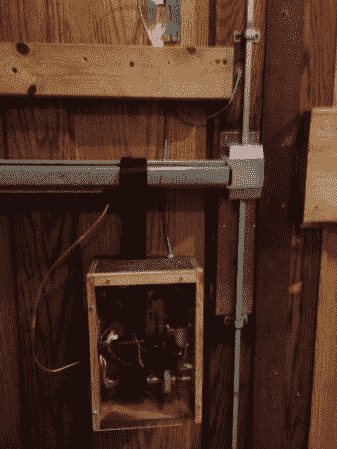

# RFID 门禁机器人

> 原文：<https://hackaday.com/2013/11/10/rfid-door-access-robot/>

我们喜欢黑客空间。一些最具创新性的解决方案来自他们，这要归功于志趣相投的人都聚集在同一个地方。只要看看这个来自兰辛制造商网络的令人敬畏的 RFID 门系统就知道了，它不需要对门做任何修改。

该机制的大部分以前是一个模型绘制桥，空间从一个多余的商店购买-它只需要一点黑客攻击。几乎所有的空间成员都参与了这个项目，每当构建遇到障碍，另一个成员总是有正确的解决方案。它通过使用挡风玻璃电机来收紧门推杆闩周围的安全带来工作——该系统的优点是它完全不会损坏门，门的工作方式和以前完全一样。整个系统由 RFID 标签控制，会员拥有这些标签作为空间的钥匙。

这是一个很棒的项目，[Brian]写了一篇关于它的非常棒的文章，这也恰好很好地进入了黑客空间的话题。他将黑客空间描述为

> 真实生活的维基百科，以及这里的一切(工具、设备、资源)只是把我们所有人拉在一起的诱惑。

休息后留下来看看这一机制的运作吧！

[https://www.youtube.com/embed/blJulmDmmYE?version=3&rel=1&showsearch=0&showinfo=1&iv_load_policy=1&fs=1&hl=en-US&autohide=2&wmode=transparent](https://www.youtube.com/embed/blJulmDmmYE?version=3&rel=1&showsearch=0&showinfo=1&iv_load_policy=1&fs=1&hl=en-US&autohide=2&wmode=transparent)