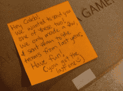
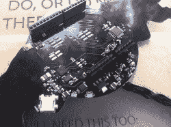
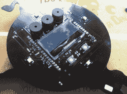
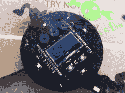

# 由红牛公司生产

> 原文：<https://hackaday.com/2012/06/27/rickrolled-by-redbull/>

[https://www.youtube.com/embed/T7KtONitRaY?version=3&rel=1&showsearch=0&showinfo=1&iv_load_policy=1&fs=1&hl=en-US&autohide=2&wmode=transparent](https://www.youtube.com/embed/T7KtONitRaY?version=3&rel=1&showsearch=0&showinfo=1&iv_load_policy=1&fs=1&hl=en-US&autohide=2&wmode=transparent)

正如你已经看到的，我们被邀请参加[红牛创作大赛](http://hackaday.com/2012/06/15/redbulls-new-creation-contest-comes-to-your-workshop/)。当我们今天深入工作，把东西拆开，把东西焊接在一起，同时尽量不把自己炸飞的时候，我们收到了第二个包裹！它有一张手写的便条，解释说这是最后一张，只留给最棒的团队。我们拿到了最后一个。

这个盒子里是另一个 bullduino。这个上面有一个盾牌，中间有一个别致的显示器和几个分散的 led。插上电源后，迎接我们的是一个“西蒙”风格的游戏，你可以使用 pcb 上的电阻触摸板来玩。你可以在上面的视频中看到结果。此外，我的鼻子不太好使，但我的妻子告诉我，红牛邮件闻起来像培根。我不确定这是不是故意的。

我们的项目进展顺利。今天的初步测试产生了惊人的结果，皮下血肿最小。我们期待着向公众展示这个怪兽。敬请期待！

