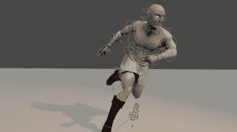

# 在现实世界中操纵你的 3D 模型

> 原文：<https://hackaday.com/2014/09/02/rigging-your-3d-models-in-the-real-world/>

计算机动画是一项既精细又繁琐的任务，需要将计算机模型处理成一系列保存为关键帧的姿势，并通过调整计算机在每帧之间的插值方式来进一步细化。你需要一个钻机(一种数字骨架)来精确控制这个模型，研究人员[Alec Jacobson]和他的团队已经开发出一种替代推动像素的实用方法。

Control curves (the blue circles) allow for easier character manipulation.

电脑动画角色的骨骼系统由[运动链](http://en.wikipedia.org/wiki/Kinematic_chain)组成——从一个根节点延伸到最小末端的关节。操纵这些关节通常需要添加易于选择的控制曲线，这简化了关节沿链向下旋转的方式。控制曲线做一些幕后的[运算](http://en.wikipedia.org/wiki/Inverse_kinematics)，允许动画师通过抓取自然的末端节点来移动角色，比如手或脚。抬起角色的脚放在椅子上需要操纵一条控制曲线:抓住脚控制，移动脚。如果没有这些曲线，动画师的工作通常是三倍:她必须首先旋转腿与臀部接合处的关节，将腿伸直，然后向下旋转膝盖，然后旋转脚踝。一场噩梦。

[Alec]和他的团队的独特替代方案是一个可互换的 3D 打印机械零件系统，用于驱动屏幕上的角色。这种效果就像数字木偶戏一样，但着眼于精确。他们的设备由中央控制器、接头、分离器、延伸部分和端盖组成。连接到控制器的关节在装配时会实时出现在 3D 环境中，真实世界装备和模型比例之间的差异可以在软件中或通过塑料延伸件进行调整。

塑料关节在所有三个方向(X，Y，Z)旋转，并通过嵌入式霍尔传感器和永磁体记录测量结果。查看附带的文章[这里](http://igl.ethz.ch/projects/character-articulation-input-device/tangible-and-modular-input-device-for-character-articulation-siggraph-2014-jacobson-et-al.pdf) (PDF)了解关于关节装置的细节，然后在休息后观看演示视频。

[https://www.youtube.com/embed/vBX47JamMN0?version=3&rel=1&showsearch=0&showinfo=1&iv_load_policy=1&fs=1&hl=en-US&autohide=2&start=216&wmode=transparent](https://www.youtube.com/embed/vBX47JamMN0?version=3&rel=1&showsearch=0&showinfo=1&iv_load_policy=1&fs=1&hl=en-US&autohide=2&start=216&wmode=transparent)

[谢谢山姆]