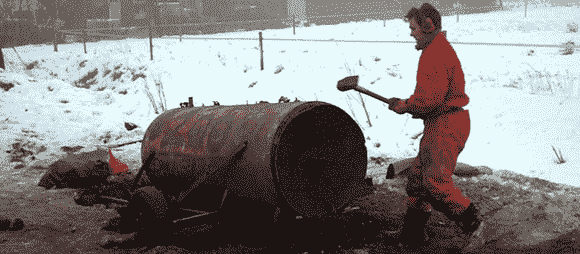

# 用 Arduino 和碳化钙迎接新年

> 原文：<https://hackaday.com/2012/12/30/ringing-in-the-new-year-with-an-arduino-and-calcium-carbide/>

这是我们第一次听说它，但是在荷兰一个叫做 Carbidschieten 的新年前夜传统听起来很合我们的胃口。基本上，一小块碳化钙和一点点水被放在一个金属搅乳器里。碳化物分解成乙炔，火焰被举到搅乳器的一个小孔上。随之而来的爆炸把牛奶搅乳器的盖子震到了田野上，所有人都很开心。

[Edwin Eefting]，[Johan Postema]，[Elger Postema]在新的一年里爆炸了 1000 升乙炔，他们需要一种安全的方式来引爆他们的庆祝活动。他们想出了一种基于 Arduino 的电子点火系统，这种系统发出的噪音可能和爆炸本身一样大。

这个构建基本上是一个带有几个继电器的 Arduino。当按下一对按钮超过一秒钟时，Arduino 会进入倒计时模式，并发出必要的警报和铃声。当需要点燃碳化炮时，电源打开，加热电热塞，点燃乙炔。这是一个伟大的建设，并增加了足够的安全事件涉及爆炸 1000 升乙炔。

你可以在休息后看看倒计时器的视频，或者在这里看看脸书组合。

[https://www.youtube.com/embed/HhiQRcq_gBA?version=3&rel=1&showsearch=0&showinfo=1&iv_load_policy=1&fs=1&hl=en-US&autohide=2&wmode=transparent](https://www.youtube.com/embed/HhiQRcq_gBA?version=3&rel=1&showsearch=0&showinfo=1&iv_load_policy=1&fs=1&hl=en-US&autohide=2&wmode=transparent)