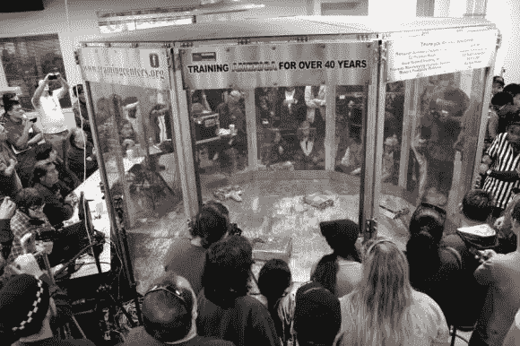

# 机器人笼斗还是个东西！

> 原文：<https://hackaday.com/2014/04/04/robot-cage-fighting-is-still-a-thing/>

还记得战斗机器人吗？结果它在南加州的国家工具和加工协会(NTMA)机器人联盟上活得好好的。没错——高中生正在建造遥控武器化机器人，在聚碳酸酯八角形竞技场内决一死战。**棒极了。**

[Bradley Hanstad]今天写信通知我们 2014 年地区比赛——明天上午 10 点(PDT)举行。我们自己不能去那里，但是有一个[现场直播供大家观看！](http://www.twitch.tv/robotrevo)

该联盟今年秋天刚刚成立，目前由 15 所地区高中、社区大学和技术学校组成。该联盟的目标是激发年轻学生对工程和制造的兴趣，同时提供科学应用方面的实践教育。让学生参加工程竞赛有时很棘手——但是一旦你提到战斗机器人，你就会吸引大多数人的注意力。

要看这些比赛的预告片，请在休息后留下来！

[https://www.youtube.com/embed/F3OJ5rHmUVY?version=3&rel=1&showsearch=0&showinfo=1&iv_load_policy=1&fs=1&hl=en-US&autohide=2&wmode=transparent](https://www.youtube.com/embed/F3OJ5rHmUVY?version=3&rel=1&showsearch=0&showinfo=1&iv_load_policy=1&fs=1&hl=en-US&autohide=2&wmode=transparent)