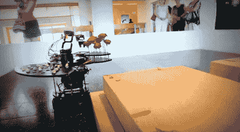

# 机器人在纪念死者的同时照顾墓碑

> 原文：<https://hackaday.com/2012/08/10/robot-cares-for-grave-stones-while-honoring-the-dead/>

在犹太传统中，这个机器人是为了照顾坟墓和纪念死者而制造的。它被称为“Stoney ”,是由[Zvika Markfeld]基于[Itamar Shimshony]的概念开发的，他正在努力获得 MFA 学位。上图显示了它作为装置的一部分的作用；据我们所知，它还没有被用作真正的墓地。但是这个概念不是一个笑话；这让观察者思考。

机器人的底座是 iRobot Roomba，顶部是一个机器人手臂平台。手臂可以方便地使用两个调色板，一个拿着小石头，另一个拿着花。还有一个装抹布的小盒子。它在坟墓周围导航，放置石头、鲜花，并使用抹布和饮水机象征性地清洁墓碑。所有这些都由 Arduino Mega 板控制，该板控制另一个运行 arm 的 Arduino，以及 Roomba 中的微控制器。

仪式的细节，以及机器人的组成部分在休息后的剪辑中得到了很好的解释。

[https://www.youtube.com/embed/wRMqVL__yLE?version=3&rel=1&showsearch=0&showinfo=1&iv_load_policy=1&fs=1&hl=en-US&autohide=2&wmode=transparent](https://www.youtube.com/embed/wRMqVL__yLE?version=3&rel=1&showsearch=0&showinfo=1&iv_load_policy=1&fs=1&hl=en-US&autohide=2&wmode=transparent)