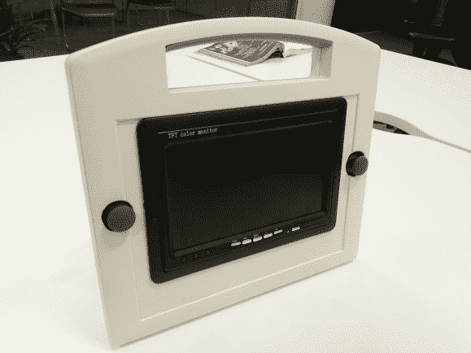

# 机器人控制器比真正的 Wii-U 更有趣

> 原文：<https://hackaday.com/2014/02/15/robot-controller-more-fun-than-an-actual-wii-u/>

好吧，这可能不公平，因为我们从来没有尝试过 Wii-U。但是这难道不像是一个比玩游戏机更好的控制机器人的主意吗？

上面的照片有点骗人，因为该单位实际上有相当多的深度。尽管如此，建筑的整洁还是给人留下了深刻的印象。[Alec Waters]从汽车用备用显示器开始(我们估计是 7 英寸)。有一个无线电接收器，两个模拟操纵杆，当你拿着控制器时，你的拇指可以在那里排成一行，还有一个 Arduino 可以将它们拉在一起。如果你还不明白，这显示了他控制的机器人的无线视频。他还包括一个辅助端口，可以让你绕过无线电接收器，直接插入视频信号。

仍然相信你需要任天堂的内置屏幕的消费控制器。是的，[它可以被破解来与你所有的项目一起工作](http://hackaday.com/2013/12/30/using-the-wii-u-controller-with-everything/)。但说真的，这更有趣。