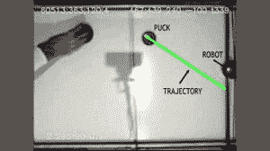

# 机器人主宰空气曲棍球，吓坏了韦恩·格雷兹基约翰·康纳

> 原文：<https://hackaday.com/2014/02/05/robot-dominates-air-hockey-frightens-john-connor-wayne-gretzky/>

在渴望玩空气曲棍球却找不到对手后，我们都曾在生活中的某个时刻感到失望。这在[Jose]家已经不是问题了。他建造了一个非常惊人的[空气曲棍球机器人](http://cienciaycacharreo.blogspot.com.es/2014/02/new-project-air-hockey-robot-3d-printer.html)。这个机器人在两个方向上移动，可以预测冰球的移动，也可以决定阻挡，射门或两者结合。

令人惊讶的是，大多数“机器人”部件都是 3D 打印机遗留下来的，其中包括:NEMA17 步进电机，Arduino Mega，斜坡板，电机驱动器，皮带，轴承和杆。支架、冰球和球拍都是 3D 打印的。空气曲棍球台本身是使用现成的木材从零开始建造的。两个标准的 90 毫米 PC 风扇负责产生用于提起冰球的气压。PS3 摄像机监控着动作，实际上是这个机器人在空中的*眼睛*。

休息之后，请观看视频，了解更多关于这个项目的信息。

也许这个版本最令人印象深刻的部分是它的工作方式。安装在桌子上方的摄像机观察冰球并确定其轨迹。然后，机器人将球拍移动到适当的位置来阻挡和返回冰球。轨迹预测甚至可以考虑墙壁的反弹。如果你是一个输不起的人，很容易调整机器人的速度、加速度和策略算法，以确保自己获胜。

这是一个复杂的构建，何塞确实有一些问题需要解决。最初，横跨工作台的轨道是由钢制成的，结果对于龙门所需的性能特征来说太重了。钢棒被用于风筝的碳纤维管所取代。更轻的重量减少了机架的惯性，允许用更少的电机力进行更快的移动。

如果你想试着制造一个这样的机器人，[Jose]已经写了一份非常详细的[手册](https://docs.google.com/a/hackaday.com/document/d/1SXIIW5MG1uT7O6P6tBWwzjiLe_gj4_Z2HHhHXPehwso/edit)，并且在他的网站上提供了所有的软件和固件文件。如果他在一年前开发了这个，我们确信他会在这次[锦标赛](http://hackaday.com/2013/05/18/robot-air-hockey-championship-as-a-final-project/)上把奖杯带回家。

[https://www.youtube.com/embed/CjzSeOg8oTs?version=3&rel=1&showsearch=0&showinfo=1&iv_load_policy=1&fs=1&hl=en-US&autohide=2&wmode=transparent](https://www.youtube.com/embed/CjzSeOg8oTs?version=3&rel=1&showsearch=0&showinfo=1&iv_load_policy=1&fs=1&hl=en-US&autohide=2&wmode=transparent)