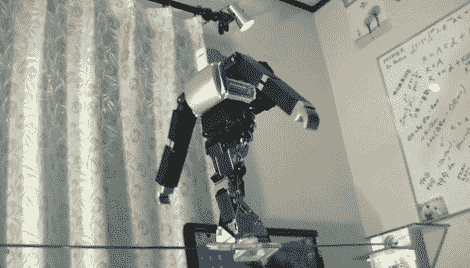

# 机器人表演走钢丝

> 原文：<https://hackaday.com/2012/10/19/robot-performing-a-tightrope-act/>

这个[机器人能够走钢丝](http://ai2001.ifdef.jp/) ( [翻译](http://translate.google.com/translate?sl=auto&tl=en&js=n&prev=_t&hl=en&ie=UTF-8&layout=2&eotf=1&u=http%3A%2F%2Fai2001.ifdef.jp%2F))。嗯，与其说是走，不如说是拖步，但还是比我们能做的好多了。

在休息后的视频中，你可以看到机器人在右边的平台上启动。当它走上钢丝(位于其脚底的凹槽中)时，机器人张开双臂帮助保持平衡。当另一只脚离开平台时，这是我们看到的最后一步，直到它到达另一边。接下来的动作是一次一点点地滑动双脚，直到完全滑过去。

Guero 博士]也一直在研究至少另一种平衡器。休息后还嵌入了一个骑自行车的机器人。当停止时，它实际上会放下一只脚，然后结结巴巴地蹬出一只脚，再继续前进。这家伙会在家门口的死星走廊里从你身边经过。

绷紧的绳子:

[https://www.youtube.com/embed/P5j619mdesM?version=3&rel=1&showsearch=0&showinfo=1&iv_load_policy=1&fs=1&hl=en-US&autohide=2&wmode=transparent](https://www.youtube.com/embed/P5j619mdesM?version=3&rel=1&showsearch=0&showinfo=1&iv_load_policy=1&fs=1&hl=en-US&autohide=2&wmode=transparent)

自行车:

[https://www.youtube.com/embed/SqBw7XapJKk?version=3&rel=1&showsearch=0&showinfo=1&iv_load_policy=1&fs=1&hl=en-US&autohide=2&wmode=transparent](https://www.youtube.com/embed/SqBw7XapJKk?version=3&rel=1&showsearch=0&showinfo=1&iv_load_policy=1&fs=1&hl=en-US&autohide=2&wmode=transparent)

[感谢 Lern via [机器人梦](http://www.robots-dreams.com/2012/10/dr-gueros-amazing-tightrope-walking-robot-video.html)