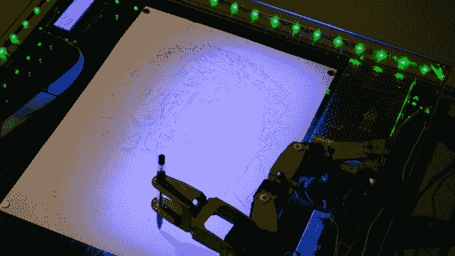
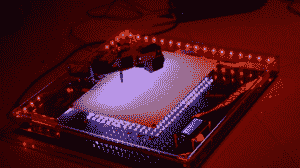

# 机器人画家画出它看到的东西

> 原文：<https://hackaday.com/2014/04/28/robotartist-draws-what-it-sees/>

这位自动化艺术家实现了简单与复杂的完美平衡。[Roboartist 是一个矢量绘图机器人](http://hackaday.io/project/895-Roboartist)，【Niazangels】，【Maxarjun】和【Ashwin】在过去的几天里一直在记录这个项目。该产品的杀手锏是能够处理通过网络摄像头看到的内容，以便机器人手臂可以在纸上绘制出墨迹。

手臂本身有四个阶段，正如你在下面的视频中看到的，非常小的斜率。剩下的轻微摆动足以使图像看起来好像没有印刷完美，我们喜欢这种效果！

上图是一名机器人艺术家正在为《黑暗骑士 *中的小丑【希斯·莱杰】画像。*图像导入功能用于此目的。它运行一个调整版的[精明的边缘检测器](http://en.wikipedia.org/wiki/Canny_edge_detector)来确定笔画的走向。这是通过网络摄像头捕捉对象的替代方法。目前，MATLAB 是软件链的一部分，但未来的工作寻求升级到更多的开源工具。硬件本身使用 Arduino Mega 通过 USB 或蓝牙接收输入，并相应地驱动四个伺服电机。

 除了你能看到的丙烯酸绘图表面周围的发光二极管，下面还有一排排 RGB 条纹。该软件运行一个过滤器的照明不足，以恭维在纸上的线条。这就是为什么有一个紫色的色调向一侧逐渐消失的原因。

Roboartist 将是一个梦幻般的办公室艺术品；您可以在贵宾参加会议时在摄像机前展示他们，并在他们离开时向他们展示草图！

[https://www.youtube.com/embed/VNjaRLj1WhA?version=3&rel=1&showsearch=0&showinfo=1&iv_load_policy=1&fs=1&hl=en-US&autohide=2&wmode=transparent](https://www.youtube.com/embed/VNjaRLj1WhA?version=3&rel=1&showsearch=0&showinfo=1&iv_load_policy=1&fs=1&hl=en-US&autohide=2&wmode=transparent)