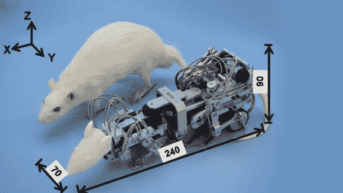

# 机器鼠洪流和沮丧的真鼠

> 原文：<https://hackaday.com/2013/03/18/robotic-rat-torments-and-depresses-real-rats/>

动物实验一直是一个有争议的话题。一方面，它让我们能够确定某种东西对人类是否安全。另一方面，它伤害和杀死了帮助我们逃脱同样命运的动物。不管你怎么看，感谢你不是实验室的小白鼠。作为哺乳动物，它们和我们有相似的生理结构。它们也容易繁殖和处理。这些特性使它们成为测试药物和治疗安全性的主要对象，这些药物和治疗可能有一天会用于人类。日本东京早稻田大学的科学家们创造了一个新的老鼠克星——WR-3，这是一个以科学的名义专门设计来给实验室动物施加压力和使其沮丧的机器人。

在野外，老鼠通常不会担心抑郁。因此，WR-3 试图灌输给他们。机器人有三个功能:连续攻击(无情地撞击受害者)，交互攻击(每当受害者移动时攻击 5 秒，然后停止)，追逐(就在受害者旁边，但从不攻击)。科学家发现，让老鼠抑郁的最好方法是在它们年轻时连续攻击它们，然后在它们变老时交互攻击。

科学家们从这些新实验中获得的数据，他们希望了解更多关于人类抑郁症的知识，并有望提出更成功的治疗方法。我们找不到太多关于 WR-3 的具体信息，但我们会随时通知你。

[通过 [Gizmodo](http://gizmodo.com/)