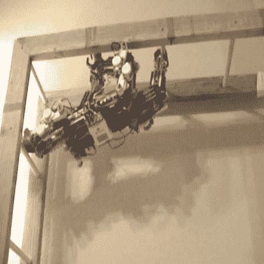

# 机器树懒出没在你的梦里

> 原文：<https://hackaday.com/2013/11/11/robotic-sloth-haunts-your-dreams/>

你见过湿树懒吗？他们很可怕。如果这还不够糟糕，你觉得机器人怎么样？

X-4 被命名为“树懒”，这是[222 doc]迄今为止最难的项目之一——一种高度实验性的四角形机器人，可以爬上爬下。它使用了一个乐高 Mindstorms NXT 控制器，8 个关节伺服电机，4 个手部功能电机，以及一大堆乐高玩具。由于电机的数量，他还必须复用动力功能伺服系统，使其全部工作！

当然，这是乐高，但这绝不是一个简单的项目，因为[222Doc]估计他在这上面花了 100 多个小时，而且它仍然不完整。他说他再也不会对自己说“这很容易……”了。

休息后留下来看它爬梯子——我们希望他们加快视频速度，看起来移动速度是模仿一只真正的树懒……

[https://www.youtube.com/embed/gSyrBDyAwAw?version=3&rel=1&showsearch=0&showinfo=1&iv_load_policy=1&fs=1&hl=en-US&autohide=2&wmode=transparent](https://www.youtube.com/embed/gSyrBDyAwAw?version=3&rel=1&showsearch=0&showinfo=1&iv_load_policy=1&fs=1&hl=en-US&autohide=2&wmode=transparent)

[通过[使](http://makezine.com/2013/11/08/mindstorms-slothbot-climbs-ladders/)