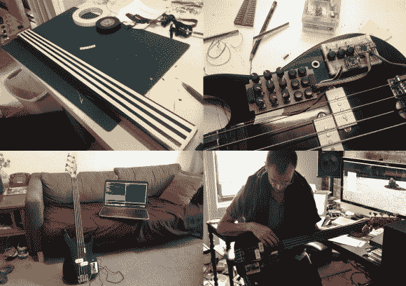

# 用你的带状控制器低音摇滚起来

> 原文：<https://hackaday.com/2014/03/28/rock-out-with-your-ribbon-controller-bass/>

[Brendan Byrne]将这种乐器简化为基础，为自己制作了一把带状控制器低音吉他。他的网站上的细节仍然有点稀疏[，但是在他的 flickr 流](http://wtfbyrne.tumblr.com/post/80887258054/ribbon-controller-bass-guitar-build)上有大量详细的图片[。[Brendan]在帕森斯新设计学校制作了他的贝斯，作为](https://www.flickr.com/photos/52082118@N05/sets/72157643013390063/)[未来吉他设计课程](http://ctm.parsons.edu/the-future-of-guitar-and-instrument-design/)的一部分。他的目标是创造一种体验，在这种体验中，演奏乐器和改变效果参数是由相同的手势触发的。他在这一努力中无疑取得了成功。

基本上，低音是一个四通道带状控制器。为了给四个石墨条让路，音柱被移走了。【Brendan】跟随【Iain 的】[优秀教程](http://iainmccurdy.org/diy/ribboncontroller/)用柔软的艺术家铅笔创作自己的石墨条。色带实质上变成了电位计，然后被一个十几岁的孩子读取。[Brendan]通过添加几个映射到 MIDI 控制代码的按钮和电位计，扩展了乐器的声音调板。他甚至包括一个三轴加速度计，这样低音的每个动作都可以被映射出来。MIDI 数据被发送到运行商业音乐软件的 PC。模拟声音来自放置在低音琴桥下的压电拾音器。

结果相当不错。虽然我们不能说[Brendan]的演示对我们来说是音乐，但我们肯定看到了这种乐器的音乐可能性。

[https://www.youtube.com/embed/tJALDEuah-A?version=3&rel=1&showsearch=0&showinfo=1&iv_load_policy=1&fs=1&hl=en-US&autohide=2&wmode=transparent](https://www.youtube.com/embed/tJALDEuah-A?version=3&rel=1&showsearch=0&showinfo=1&iv_load_policy=1&fs=1&hl=en-US&autohide=2&wmode=transparent)

[https://www.youtube.com/embed/sbZyTGPptWw?version=3&rel=1&showsearch=0&showinfo=1&iv_load_policy=1&fs=1&hl=en-US&autohide=2&wmode=transparent](https://www.youtube.com/embed/sbZyTGPptWw?version=3&rel=1&showsearch=0&showinfo=1&iv_load_policy=1&fs=1&hl=en-US&autohide=2&wmode=transparent)

【感谢 JohnS_AZ！]