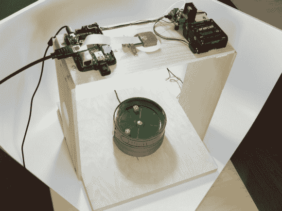

# 与 Dicebot 一起滚动，Tweeting 骰子滚动器

> 原文：<https://hackaday.com/2014/06/18/roll-with-dicebot-the-tweeting-dice-roller/>

[David]对 1920 年的掷骰子游戏进行了现代化改造，为我们带来了 [DiceBot，一个支持 twitter 的掷骰子机器人](http://www.intridea.com/blog/2014/5/28/announcing-dicebot-the-internet-connected-and-twitter-controlled-dice-roller)。DiceBot 始于一个古董骰子罐。最初的锡是由人类控制的。按下罐子边上的按钮会旋转底部，掷骰子。

从世界的另一端按下一个按钮有点困难，所以[大卫]增加了一个小马达来旋转罐子。他将电机连接到一个简单的 L298 电机驱动芯片上，并将其连接到一个树莓派上。Pi 运行一些定制的 Ruby 脚本，这些脚本将它放到互联网上，并连接到 Twitter API。

操作非常简单。一条标签为#RollTheDice 的推文到@IntrideaDiceBot 将导致 DiceBot 旋转骰子。一旦事情尘埃落定，DiceBot 就用它的 Raspberry Pi 相机捕捉图像。使用 OpenCV 检查骰子值。结果随后被推回，并显示在 DiceBot 的[结果页面](http://dicebot.intridea.com/)上。

[https://player.vimeo.com/video/98262190](https://player.vimeo.com/video/98262190)

更多的 DiceBot，请查看[【大卫的】flickr 流](https://www.flickr.com/photos/davidnaffis/sets/72157645029551545/ )。