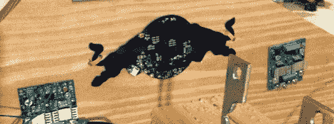

# 红牛创作大赛的过山车模拟器

> 原文：<https://hackaday.com/2012/07/04/roller-coaster-simulator-for-the-redbull-creation-contest/>

[戴夫]和[马丁]，又名弹道机车，提交了他们参加红牛创作比赛。这是一个[过山车模拟器](http://www.youtube.com/watch?v=IExpqaoh6Uk)，可以在你的客厅里模拟过山车的曲折、转弯和下降。

模拟器是围绕一个安装在 2 自由度桌子上的胶合板过山车建造的。提供了一些第一人称过山车视频和速度、滚动和倾斜数据。弹道机车有一个功能正常的过山车模拟器。

当然，如果没有风吹过你的头发，观看过山车的第一人称镜头是不一样的体验。为了模拟过山车乘坐的这一方面，弹道机车团队在 bullduino 上连接了一个继电器，并连接了一个[地毯干燥风扇](http://ballisticlocomotive.wordpress.com/2012/06/26/fan-control-3/)。

弹道机车不仅用他们的 bullduino 建造了一些令人敬畏的东西，他们还设法在这个周末为一个建造者的儿子的生日聚会制造了一个伟大的乘坐。休息之后你可以看看演示和几个视频。

[https://www.youtube.com/embed/i1Jmdy-LOFA?version=3&rel=1&showsearch=0&showinfo=1&iv_load_policy=1&fs=1&hl=en-US&autohide=2&wmode=transparent](https://www.youtube.com/embed/i1Jmdy-LOFA?version=3&rel=1&showsearch=0&showinfo=1&iv_load_policy=1&fs=1&hl=en-US&autohide=2&wmode=transparent)
[https://www.youtube.com/embed/jRAP0v-lBfc?version=3&rel=1&showsearch=0&showinfo=1&iv_load_policy=1&fs=1&hl=en-US&autohide=2&wmode=transparent](https://www.youtube.com/embed/jRAP0v-lBfc?version=3&rel=1&showsearch=0&showinfo=1&iv_load_policy=1&fs=1&hl=en-US&autohide=2&wmode=transparent)
[https://www.youtube.com/embed/IExpqaoh6Uk?version=3&rel=1&showsearch=0&showinfo=1&iv_load_policy=1&fs=1&hl=en-US&autohide=2&wmode=transparent](https://www.youtube.com/embed/IExpqaoh6Uk?version=3&rel=1&showsearch=0&showinfo=1&iv_load_policy=1&fs=1&hl=en-US&autohide=2&wmode=transparent)