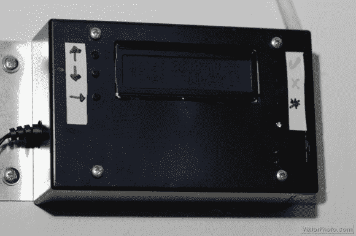

# 滚动你自己的炉子控制器

> 原文：<https://hackaday.com/2012/12/11/rolling-your-own-furnace-controller/>

[Viktor 的]找到了一个机会，在他所在大楼的炉子控制器出现故障时，将他的嵌入式设计技能派上了用场。他承认，购买替代品会容易得多，但远没有这么有趣。相反，他基于 PIC 18F4550 制造了这个炉子控制器。

首先，你可能会觉得奇怪，我们称之为炉子控制器，而不是恒温器。但对硬件原理图的研究显示，该设备没有感应温度的能力。它只是根据时间表打开和关闭炉子。我们猜测这是为了一栋公寓大楼，在那里测量一个中心点的温度是不够的？

无论如何，构建是干净的，UI 看起来很容易使用。里面有一个安装在板上的 12V 继电器控制着炉子。时间表保存在微控制器的 EEPROM 中，时间由电池供电的 DS1307 记录。

我们很乐意看到这在未来得到扩展。一些可能性将是增加互联网连接和实施温度传感器的网状网络，这将向主单元提供反馈。