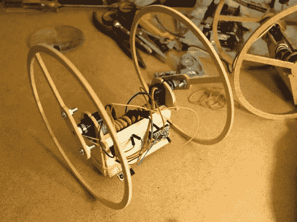

# Rolly Bot 对独立车轮控制进行了全新设计

> 原文：<https://hackaday.com/2014/08/07/rolly-bot-puts-a-new-spin-on-independent-wheel-control/>

[达西]的所有朋友都在制造轮式机器人，所以很自然，他也必须做一个。他的朋友们用 h 型桥和脚轮来实现独立的车轮操纵，使他们的设计变得复杂，但[达西]想要更简单的东西。几个 9g 伺服系统之后，[Rolly 机器人](http://inventorartist.com/rolly-bot/)诞生了。

Rolly Bot 由于重心较低，具有自平衡功能。如果它撞到墙上，身体会翻转，把它推回另一个方向。BOM 高达 10 美元，其中包括连续旋转伺服系统。这还不包括他后来添加的远程控制功能，或者完全复制这种构造所需的 CNC 成本。他甚至做了一个架子，以便在编程时测试轮子。

[Darcy]的代码和其他人制作的另一个版本的一些图片在他的网站上。观看 Rolly Bot 在跳跃后翻滚。

你如何使这个构建更加简单？请在评论中告诉我们。

[https://www.youtube.com/embed/Y8Uz741XLVQ?version=3&rel=1&showsearch=0&showinfo=1&iv_load_policy=1&fs=1&hl=en-US&autohide=2&wmode=transparent](https://www.youtube.com/embed/Y8Uz741XLVQ?version=3&rel=1&showsearch=0&showinfo=1&iv_load_policy=1&fs=1&hl=en-US&autohide=2&wmode=transparent)