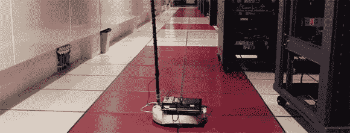

# Roomba 成为数据中心机器人

> 原文：<https://hackaday.com/2013/02/13/roomba-becomes-data-center-robot/>

运行一个数据中心需要大量的工作，甚至确保数百个机箱的环境温度在适当的范围内也是一项艰巨的任务。当面对在 EMC 数据中心安装数百个温度传感器的前景时，[Vivek]有了一个更好的主意:在机器人上放置几个传感器[，绕着机架行驶](http://www.viveknadar.com/inquisitive/2013/02/say-hello-to-emcs-data-center-robot-.html)。有了合适的软件，为一个庞大的数据中心实现过程自动化和构建近乎实时的温度监控解决方案变得轻而易举。

数据中心机器人基于 iRobot Create T1，基本上是一个没有真空的 Roomba。连接到机器人的是一个上网本、Arduino 和一个 PVC 桅杆，其中装有三个温度传感器和一个 USB 网络摄像头。

机器人使用数据中心的地板进行导航，搜索机架，通过 WiFi 将温度数据发送回服务器。从那里，可以绘制温度图表，以确保机架不会太热或太冷。

休息之后，你可以看看机器人的视频。

[https://www.youtube.com/embed/4zZoev0IWIc?version=3&rel=1&showsearch=0&showinfo=1&iv_load_policy=1&fs=1&hl=en-US&autohide=2&wmode=transparent](https://www.youtube.com/embed/4zZoev0IWIc?version=3&rel=1&showsearch=0&showinfo=1&iv_load_policy=1&fs=1&hl=en-US&autohide=2&wmode=transparent)