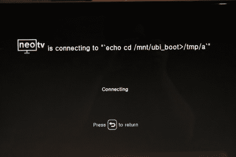

# 从沙发上翻出一个 NeoTV 机顶盒

> 原文：<https://hackaday.com/2012/10/25/rooting-a-neotv-set-top-box-from-the-couch/>

NeoTV 是 Netgear 制造的机顶盒，用于与 Roku 等公司竞争。它从网飞、Hulu Plus 和 YouTube 等常见的互联网来源传输视频。[Craig]最近打开了他的装置，在这个过程中他发现除了遥控器之外，NeoTV 什么也不能用。

他从硬件概述开始。该机箱采用单板 ARM 设计，具有 128 MB NAND 和 256 MB RAM。串口很容易找到，但是它不提供根 shell(这通常是根设备最简单的方法之一)。接下来，他开始研究未加密的固件更新，看看他能学到什么。他就是这样发现连接 WiFi 时的 SSID 值被馈入 system()命令的。这个明显的安全漏洞让你可以在设备上运行任何你想运行的东西，方法是以假 SSID 名称发出命令。这只是一点 Linux 知识的问题，现在[Craig]在他的设备上有根访问权限。