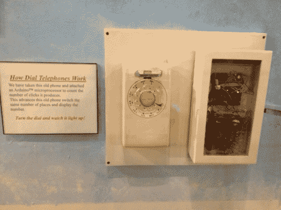

# 旋转电话博物馆展览

> 原文：<https://hackaday.com/2013/08/21/rotary-phone-museum-exhibit/>

【David Burroughs】来信分享了[他建造的这个电话博物馆展览](http://www.roadsnrails.com/2013/03/dial-telephone-display/)，我们很高兴他这样做了，因为我们喜欢互动的博物馆黑客。他提到这与安装它的 T3 公路和铁路博物馆的主题无关。但是当我们想到铁路历史时，我们也会想到电报。这只是从电话的一跳，一蹦，一跳。

这个显示器可以让博物馆的参观者玩手机上的转盘。下两个盒子里有一个 10 位继电器增量开关。所以刻度盘的每一个脉冲都会增加开关。有一个令人满意的点击，一个移动的手臂，和不同颜色的发光二极管，突出内部工作。Arduino 板监控电话，在七段显示器上显示拨号号码，然后增加继电器。

我们认为有趣的部分是看到电话过去像这样使用机械开关。但下面的视频包含了一个关于一个孩子的故事，他问你是如何随身携带这部手机的。这让我想起了“挂断电话”这个短语，它的字面意思和以前不一样了。

[https://www.youtube.com/embed/0Lm1WqniP4Y?version=3&rel=1&showsearch=0&showinfo=1&iv_load_policy=1&fs=1&hl=en-US&autohide=2&wmode=transparent](https://www.youtube.com/embed/0Lm1WqniP4Y?version=3&rel=1&showsearch=0&showinfo=1&iv_load_policy=1&fs=1&hl=en-US&autohide=2&wmode=transparent)