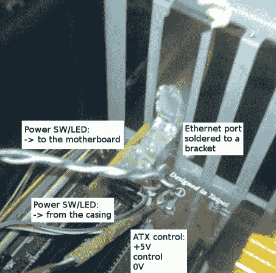

# RPi 通过互联网控制你的服务器 PSU

> 原文：<https://hackaday.com/2013/05/24/rpi-control-your-server-psu-over-the-internet/>

这里有一个有趣的使用[树莓 Pi 来控制服务器](http://mupuf.org/blog/2013/05/11/wtrpm-a-web-based-wt-suite-to-power-up-slash-down-your-computers/)上的 PSU。[Martin Peres]将离开几个月，但仍想访问他的 PC。这真的没有那么难…这就是 SSH 的用途。但他也希望对硬件进行低级别的访问。具体来说，他需要控制 PSU 正在做什么并获得反馈，甚至希望能够访问串行控制台，而不必通过计算机的网卡。

上图展示了他的解决方案的一部分。这是一个定制的以太网端口，连接到他的 Rasberry Pi 头分线板。在计算机内部，插孔连接到主板电源 LED，以反馈电源的当前状态。它还可以接入 PSU 上的绿色电线，让他通过将电线拉到地面来打开电源。在完成电缆布线后，他开发了一个网络界面，可以很容易地与设置进行交互。

和其他类似的黑客一样，让嵌入式电脑 24/7 运行比让电脑一直开着浪费少得多。这是一个我们可以真正理解的概念。

[https://www.youtube.com/embed/6ITxOtS6MbQ?version=3&rel=1&showsearch=0&showinfo=1&iv_load_policy=1&fs=1&hl=en-US&autohide=2&wmode=transparent](https://www.youtube.com/embed/6ITxOtS6MbQ?version=3&rel=1&showsearch=0&showinfo=1&iv_load_policy=1&fs=1&hl=en-US&autohide=2&wmode=transparent)