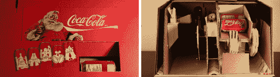

# Rube-Goldberg 提供液体饮料

> 原文：<https://hackaday.com/2013/02/19/rube-goldberg-provides-liquid-refreshment/>

左边的图片并没有让这个看起来更像，但是在纸板自动售货机里面有一个聪明的鲁贝-戈德堡装置。广告之后的视频展示了内部工作原理，展示了 25 美分硬币是如何分配一整罐可乐的。但这就是我们得到的关于这个项目的所有细节。

设计中使用了两套配重。一些弹珠和看起来像巨型弹球的东西。硬币滑槽位于自动售货机的左侧，将钱送入等待的弹珠中。当大理石滚下来时，它落在一把勺子上。重物旋转装满勺子的圆盘，使一个等待的弹球从架子上掉下来。当那个金属球落下时，它操纵一个棘轮系统来分发一罐。看起来机器的容量仅限于两罐新鲜的含糖液体，但如果有更多的空间来放罐和平衡重之类的东西，那就可以按比例增加。

[https://www.youtube.com/embed/JpB5lZLrJ_c?version=3&rel=1&showsearch=0&showinfo=1&iv_load_policy=1&fs=1&hl=en-US&autohide=2&wmode=transparent](https://www.youtube.com/embed/JpB5lZLrJ_c?version=3&rel=1&showsearch=0&showinfo=1&iv_load_policy=1&fs=1&hl=en-US&autohide=2&wmode=transparent)

[via [Reddit](http://www.reddit.com/r/somethingimade/comments/18o5tw/homemade_cardboard_vending_machine_retro_vender/)