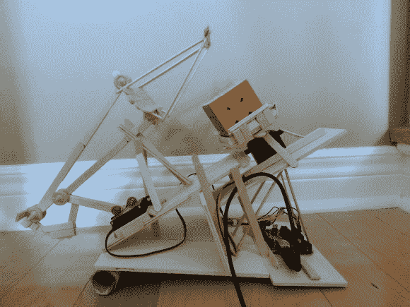

# 用冰棒棍和 Arduino 做成的魔方解算器

> 原文：<https://hackaday.com/2014/06/28/rubiks-cube-solver-made-out-of-popsicle-sticks-and-an-arduino/>

[Matt]最近学习了如何解魔方*和*Arduino 的基础知识。将两者结合在一起，他决定试着让[成为一个自动解魔方的人！](http://www.instructables.com/id/Rubiks-Cube-Solver/)

我们已经看过很多次用乐高头脑风暴做这个了，但是我们对马特巧妙使用冰棒棍和机械连接印象更深刻。该设备仅使用两个伺服系统。一个用来旋转底座，另一个用来翻转立方体。

他正在使用一台 Arduino UNO (R3 ),配有 2 台 Hitec HS-311 hobby servos、一些冰棒棍、热熔胶、一卷纸巾和一些胶合板。他自己编写了解决魔方的代码，并在 GitHub 上分享了这些代码——但他并没有就此止步，而是决定使用 Python 创建一个 GUI。

它没有那么快，但它可以在 20 分钟内解决一个立方体——休息后留下来看看它的运行！

[https://www.youtube.com/embed/gy5B6neyWf8?version=3&rel=1&showsearch=0&showinfo=1&iv_load_policy=1&fs=1&hl=en-US&autohide=2&wmode=transparent](https://www.youtube.com/embed/gy5B6neyWf8?version=3&rel=1&showsearch=0&showinfo=1&iv_load_policy=1&fs=1&hl=en-US&autohide=2&wmode=transparent)