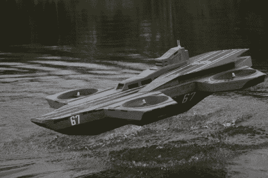

# 神盾局直升机航母起死回生

> 原文：<https://hackaday.com/2012/08/26/s-h-i-e-l-d-heli-carrier-brought-to-life/>

这幅由[Native18]创作的奇妙作品展示了复仇者联盟使用的直升机母舰的四轴直升机复制品。沿着这条线索 ( [翻译](http://translate.google.com/translate?sl=auto&tl=en&js=n&prev=_t&hl=en&ie=UTF-8&layout=2&eotf=1&u=http%3A%2F%2Fforum.rcdesign.ru%2Ff123%2Fthread283383.html))，你可以跟随他的思考过程以及他的建造过程。建筑主要是纸和轻质泡沫，但它仍然设法漂浮，甚至从水中起飞。

我们以前也见过其他航空母舰的设计，但没有几艘设计得如此完美，也没有一艘能从水中起飞。

[通过 [technabob](http://technabob.com/blog/2012/08/23/remote-controlled-helicarrier)

[https://www.youtube.com/embed/3QFHFXcIMuA?version=3&rel=1&showsearch=0&showinfo=1&iv_load_policy=1&fs=1&hl=en-US&autohide=2&wmode=transparent](https://www.youtube.com/embed/3QFHFXcIMuA?version=3&rel=1&showsearch=0&showinfo=1&iv_load_policy=1&fs=1&hl=en-US&autohide=2&wmode=transparent)