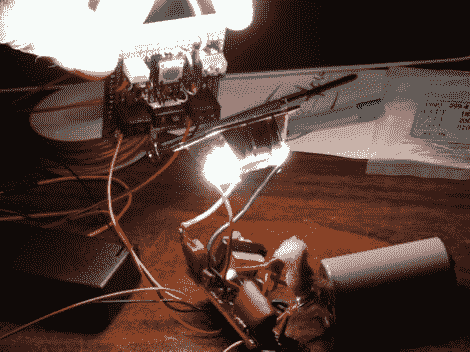

# 安全同步保护您的相机免受旧的高压闪光灯模块

> 原文：<https://hackaday.com/2012/06/22/safe-sync-protects-your-camera-from-older-high-voltage-flash-modules/>

因为我们不是高端相机爱好者，所以让我们感到惊讶的是，允许相机与闪光灯模块接口的热靴在这些年里发生了相当大的变化。显然，这种接口曾经是机电式的，因为摄像机会使用机械装置来连接热靴的两个电极。它切换的电压无关紧要，因为相机没有连接到接口的电气系统。问题是，将一台现代相机连接到(戴维·库克)所谓的“传统”闪光灯硬件可能会损坏它。因此，他开发了安全同步功能，将现代相机与老式闪光灯模块连接起来。

你可以在图像中看到他举起的板子。它包括许多很好的功能，如能够从外部闪光灯或电池供电。还有一个可选的瞬时按钮开关，可以用来测试闪光灯控制(或黑客它用于其他目的)。除了为旧设备提供保护之外，这还可以用来连接不同制造商的闪光灯模块和你的相机。