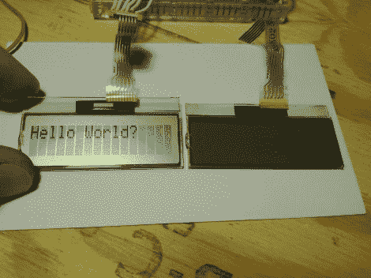

# 抢救液晶屏幕黑客

> 原文：<https://hackaday.com/2012/05/21/salvaged-lcd-screen-hacking/>

你可以在坏掉的电子产品里找到各种各样的液晶屏。但是，如果您没有可以用来嗅探通信协议的工作设备，弄清楚它们是如何被控制的通常是一件很麻烦的事情。[Justin]从一个老兄弟打印机上抢到了这个字符液晶屏，并决定看看他是否可以在自己的项目中重用它。幸运的是，驱动卡仍然工作，所以他[接入 LCD 的控制线，并在打印机通电时嗅出信号](http://justpushbuttons.com/blog/?p=263)。

他在这个项目中使用了 OpenBench 逻辑嗅探器。它很容易获取数据，还提供了分析工具。SPI 分析器设法解码命令信号和上电时弹出的“请等待”消息。在做了一点愚蠢的事情之后，他现在能够控制它了，这要感谢他写的 Arduino 库。休息后看看演示，看起来他在为设备滚动一堆不同的功能。

[https://www.youtube.com/embed/KGdUqVe2NVE?version=3&rel=1&showsearch=0&showinfo=1&iv_load_policy=1&fs=1&hl=en-US&autohide=2&wmode=transparent](https://www.youtube.com/embed/KGdUqVe2NVE?version=3&rel=1&showsearch=0&showinfo=1&iv_load_policy=1&fs=1&hl=en-US&autohide=2&wmode=transparent)