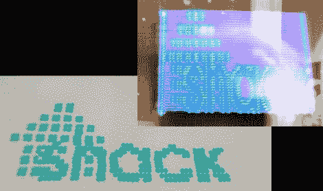

# 用于光绘和钢笔画的回收机械臂

> 原文：<https://hackaday.com/2012/06/26/salvaged-robot-arm-used-for-light-painting-and-pen-plotting/>

Shackspace 的成员得到了一个过时的机器人手臂。这是三菱 Movemaster RM-101，可能是在 20 世纪 80 年代中期制造的。几乎没有任何东西告诉你如何使用这个东西，所以[他们开始找出如何控制硬件](http://shackspace.de/?p=3284)。

这是一个很好的例子，说明了 EPROM 转储是多么有用。在进一步检查后，该小组发现该臂由 Z80 处理器驱动，其程序存储在 EPROM 中。这些人做的第一件事是转储内存，因为如果只有几个位降级，老化的存储将是无用的。对于那些芯片已经断气的人来说，这个转储真的很有用。来自那个转储的数据被分解并费力地梳理，以弄清楚什么命令被发送到手臂。这种技术奏效了，因为该团队能够重新实现控制协议，并且已经使用 arm 进行了一些光线绘制和笔绘图(见上文)。休息之后，你可以看到一个控制演示。

[https://player.vimeo.com/video/44572459](https://player.vimeo.com/video/44572459)