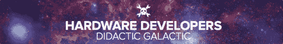

# 旧金山事件:硬件开发商说教银河

> 原文：<https://hackaday.com/2014/08/06/san-francisco-event-hardware-developers-didactic-galactic/>

说起来有点拗口，但却是一个充满乐趣的夜晚。喜欢谈论硬件需要的所有事情的旧金山人[在他们的日历上划掉这个](http://www.meetup.com/Hardware-Developers-Didactic-Galactic/events/199235342/):

硬件开发人员说教银河【2014 年 8 月 14 日星期四下午 6:00-9:30 开始
旧金山第三大街 500 号 230 套房

当晚将包括几场关于硬件的讲座；到目前为止，我们知道[马特·博格伦]正在做 FPGA 的事情，[克里斯·甘梅尔]将谈论 KiCAD，我将谈谈 Mooltipass 的社区冒险。我们也在寻找其他人来做演示，所以请站出来分享你对硬件的热情吧！

除了正式的会谈之外，还会有足够的时间来讨论所有其他的硬件设备——令人惊叹的设备。一周后的明天见，不要羞于带着自己的硬件来炫耀！